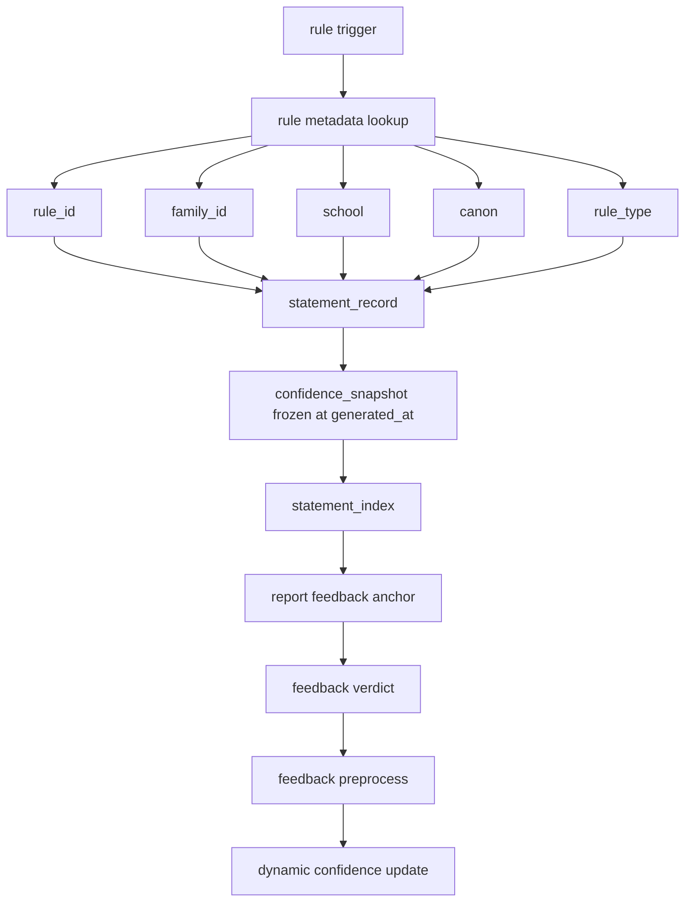
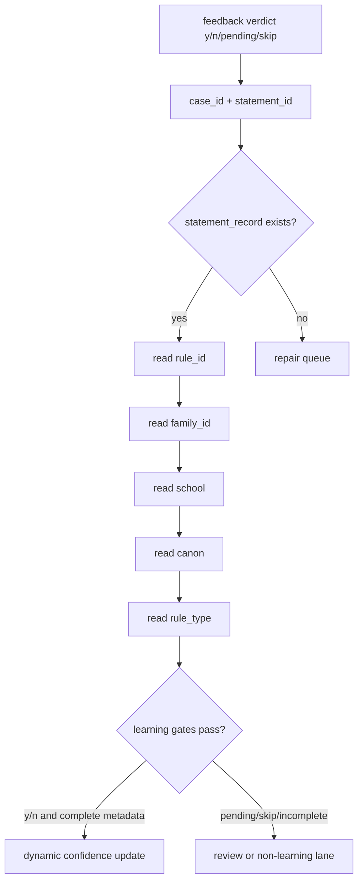

# P5-1 Statement Record Contract v1

生成时间：2026-06-12

设计性质：仅设计契约；本文件不修改 `engine/*`、`theory/*`、`tests/*` 或 `META/project-state.json`。

## 0. Executive Decision

P5-1 采用 OPTION-C：未来所有新案例从生产生成链路直接产出标准 `statement_record`，不再把历史 statement 恢复作为主方案。

核心裁决：

- `statement_record` 是未来动态置信度学习的最小事实单元。
- `statement_index` 仍可作为报告展示索引，但不得承担唯一学习索引职责。
- 反馈学习必须走正向可追踪链：`feedback verdict -> statement_id -> statement_record -> rule_id -> family_id -> school -> canon`。
- 历史案例允许共存，但默认进入 legacy / candidate / review lane，不自动反推进入 Beta 学习。

## A. Production Schema

### A.1 Schema Overview

`statement_record` 是一条“规则触发后生成的可反馈断语记录”。一条报告断语如果由多个可学习规则共同支撑，必须拆成多条 `statement_record`，每条记录只绑定一个 `rule_id` 与一个 `family_id`，避免一条反馈在多个 family 上被重复放大。

### A.2 Required JSON Schema

```json
{
  "$schema": "https://json-schema.org/draft/2020-12/schema",
  "$id": "mangpai-fusion.statement_record.v1",
  "title": "StatementRecordV1",
  "type": "object",
  "additionalProperties": false,
  "required": [
    "statement_id",
    "case_id",
    "rule_id",
    "family_id",
    "school",
    "canon",
    "rule_type",
    "statement_text",
    "confidence_snapshot",
    "generated_at",
    "source_engine_version",
    "source_rule_version"
  ],
  "properties": {
    "statement_id": {
      "type": "string",
      "minLength": 1,
      "description": "Stable statement identifier generated by the production rendering chain; must not be a fallback line id."
    },
    "case_id": {
      "type": "string",
      "minLength": 1,
      "description": "Canonical case identifier, matching the case directory id."
    },
    "rule_id": {
      "type": "string",
      "minLength": 1,
      "description": "Canonical production rule id that triggered this statement. Legacy or unmapped ids are not learning-ready unless explicitly migrated."
    },
    "family_id": {
      "type": "string",
      "minLength": 1,
      "description": "Rule family id used for family-level deduplication, cap, and posterior aggregation."
    },
    "school": {
      "type": "string",
      "minLength": 1,
      "description": "Normalized school lane for school-level weighting."
    },
    "canon": {
      "type": "string",
      "minLength": 1,
      "description": "Normalized canon/source lane for canon-level weighting."
    },
    "rule_type": {
      "type": "string",
      "minLength": 1,
      "description": "Normalized rule type used by confidence learning and governance gates."
    },
    "statement_text": {
      "type": "string",
      "minLength": 1,
      "description": "Human-readable statement text or normalized statement summary that feedback can point to."
    },
    "confidence_snapshot": {
      "type": "object",
      "additionalProperties": false,
      "required": [
        "star",
        "percent",
        "posterior_mean",
        "sample_n",
        "source"
      ],
      "properties": {
        "star": {
          "type": "integer",
          "minimum": 0,
          "maximum": 5,
          "description": "Generated-time star confidence."
        },
        "percent": {
          "type": "number",
          "minimum": 0,
          "maximum": 100,
          "description": "Generated-time percentage confidence."
        },
        "posterior_mean": {
          "type": ["number", "null"],
          "minimum": 0,
          "maximum": 1,
          "description": "Generated-time posterior mean if dynamic confidence is available."
        },
        "sample_n": {
          "type": "integer",
          "minimum": 0,
          "description": "Effective sample size at generation time."
        },
        "source": {
          "type": "string",
          "enum": ["static_rule", "dynamic_confidence", "manual_override", "fallback_initial"],
          "description": "Confidence source at generation time."
        }
      }
    },
    "generated_at": {
      "type": "string",
      "format": "date-time",
      "description": "UTC generation timestamp."
    },
    "source_engine_version": {
      "type": "string",
      "minLength": 1,
      "description": "Engine/package version that generated the record."
    },
    "source_rule_version": {
      "type": "string",
      "minLength": 1,
      "description": "Rule corpus, strategy table, or rule registry version used at generation time."
    }
  }
}
```

### A.3 Production Semantics

| Field | Contract | Learning Gate |
|---|---|---|
| `statement_id` | Stable within `case_id`; must be generated before report rendering completes | Required for feedback join |
| `case_id` | Must equal canonical case directory id | Required for case scoping |
| `rule_id` | Must be canonical production rule id or explicit migrated id | Required for Beta update |
| `family_id` | Must be resolved at generation time from rule metadata | Required for Family Weight |
| `school` | Must use normalized school lane | Required for School Weight |
| `canon` | Must use normalized canon/source lane | Required for Canon Weight |
| `rule_type` | Must use normalized rule type | Required for governance filtering |
| `statement_text` | Must preserve feedback-visible meaning | Required for audit/review |
| `confidence_snapshot` | Must freeze generated-time confidence | Required to avoid posterior time travel |
| `generated_at` | Must be UTC ISO-8601 | Required for replay/audit ordering |
| `source_engine_version` | Must identify generation implementation | Required for migration audit |
| `source_rule_version` | Must identify rule corpus/version | Required for rule drift audit |

### A.4 Optional Envelope for Storage

The required schema above is the learning record. Storage files may wrap records in an envelope:

```json
{
  "schema_version": "statement_record.v1",
  "case_id": "C-YYYY-NNN-乾-四柱",
  "records": []
}
```

The envelope is optional; the individual `statement_record` object remains the normative unit.

## B. Generation Chain

### B.1 Required Flow

```text
rule trigger
  -> resolve rule metadata
  -> create statement_record
  -> freeze confidence_snapshot
  -> emit statement_index entry
  -> render report text
  -> collect feedback verdict
  -> join feedback to statement_record
  -> update dynamic confidence
```

### B.2 Flow Diagram



### B.3 Chain Rules

1. `rule trigger` must produce or reference a canonical `rule_id` before statement rendering.
2. `rule_id -> family_id/school/canon/rule_type` must be resolved during generation, not during feedback guessing.
3. `statement_record` must be written before or at the same time as `statement_index`.
4. `statement_index` may expose only report-safe fields, but it must point to `statement_id` values that exist in `statement_record` storage.
5. `feedback` may only refer to `statement_id`; it must not need to infer rule identity from text.
6. `dynamic confidence` consumes only records that pass statement, rule, family, school, canon, rule_type, verdict, and audit gates.

## C. Feedback Writeback Chain

### C.1 Required Reverse Join Without Reverse Inference

```text
feedback verdict
  -> statement_id
  -> statement_record
  -> rule_id
  -> family_id
  -> school
  -> canon
```

### C.2 Writeback Diagram



### C.3 No Reverse Inference Guarantees

The writeback chain is valid only if all required fields are already present in `statement_record`:

- No text similarity from `statement_text` to rule templates.
- No inference from report headings to `school` or `canon`.
- No migration from legacy `M*`, `GP-*`, `GH-*`, `MR-*`, or `UNMAPPED` ids unless a controlled migration table explicitly maps them to canonical production metadata.
- No fallback line-number statement ids entering learning.
- No post-feedback confidence values backfilled into `confidence_snapshot`.

### C.4 Verdict Routing

| Verdict | Route | Dynamic Confidence Impact |
|---|---|---|
| `y` | Learning lane if metadata complete | Positive sample |
| `n` | Learning lane if metadata complete | Negative sample |
| `pending` | Review lane | No Beta update before adjudication |
| `skip` | Non-learning lane | No Beta update |
| partial / ambiguous | Review lane | No Beta update before normalization |

## D. Migration Strategy

### D.1 Coexistence Principle

New and old cases may coexist, but they must not share the same learning readiness assumption.

| Case Type | Artifact Contract | Learning Default | Governance Requirement |
|---|---|---|---|
| New case | Must emit `statement_record.v1` and compatible `statement_index` | Learning-ready if all gates pass | Hard fail if required fields missing |
| Old case with high-confidence bridge | May emit migrated `statement_record.v1` from audited bridge | Review-first; learning only after explicit approval | Must record migration source and confidence |
| Old case without bridge | Keep existing `statement_index` only | Non-learning / candidate-only | May enter repair queue, not Beta |
| Fallback preprocess row | `UNMAPPED-*` or line-based id | Non-learning | Must be excluded from dynamic confidence |

### D.2 New Case Strategy

1. Require `statement_record.v1` generation as a production artifact.
2. Treat missing `rule_id`, `family_id`, `school`, `canon`, or `rule_type` as a generation error for learning statements.
3. Permit non-learning statements only if the generator explicitly marks them outside the learning export.
4. Keep report display clean; internal fields do not need to appear in the visible report.
5. Require `statement_index` references to resolve to existing `statement_record.statement_id` values.

### D.3 Old Case Strategy

1. Do not automatically convert all historical statements to learning samples.
2. Preserve existing `statement_index.json` files as report/audit artifacts.
3. Allow optional one-time `historical_statement_trace_map` for exact-match or manually reviewed candidates.
4. Only create migrated `statement_record.v1` when `statement_id -> rule_id -> family_id -> school -> canon -> rule_type` is fully proven.
5. Mark migrated records with review status in the migration artifact; do not alter the normative schema by adding uncertain fields to the record itself.
6. Keep `UNMAPPED`, legacy-only, and text-similarity-only rows out of Beta learning.

### D.4 Migration Lanes

| Lane | Input | Output | Enters Beta? |
|---|---|---|---|
| Greenfield production | New generated rule trigger | Native `statement_record.v1` | Yes, if verdict is `y/n` |
| Audited bridge | Manual or exact high-confidence mapping | Migrated `statement_record.v1` plus migration audit | Only after approval |
| Candidate-only | Exact template match without feedback-proof bridge | Candidate trace map | No |
| Repair queue | Missing statement or metadata | Repair task | No |
| Legacy non-learning | Unmapped or deprecated ids | Non-learning audit row | No |

## E. Requirement Coverage

### E.1 Phase Compatibility

| Requirement | Status | Reason |
|---|---|---|
| Phase-1000 | Satisfied by design | Establishes stable feedback-to-rule learning input and removes reliance on fallback recovery |
| Phase-3000 | Satisfied by design | Provides durable provenance fields needed for future governance, replay, and multi-level weighting |
| Dynamic Confidence | Satisfied by design | Provides `confidence_snapshot`, `rule_id`, verdict join, and generated-time freeze |
| Family Weight | Satisfied by design | Requires `family_id` on every learning record |
| School Weight | Satisfied by design | Requires normalized `school` on every learning record |
| Canon Weight | Satisfied by design | Requires normalized `canon` on every learning record |

### E.2 Acceptance Criteria

A case is `statement_record.v1` compliant only if:

1. Every learning statement has one or more `statement_record` rows.
2. Every `statement_record` has all required schema fields.
3. Every learning `rule_id` resolves to `family_id`, `school`, `canon`, and `rule_type` before feedback ingestion.
4. Every feedback `statement_id` joins by `case_id + statement_id`, not by text matching.
5. Every dynamic confidence update can report the full chain: `feedback verdict -> statement_id -> statement_record -> rule_id -> family_id -> school -> canon`.
6. Every legacy or unresolved row is routed to review, repair, candidate-only, or non-learning lane.

## F. Final Design Decision

P5-1 concludes that `statement_record.v1` is the required Phase-1000 production contract and the forward-compatible foundation for Phase-3000 weighting. The contract satisfies dynamic confidence, Family Weight, School Weight, and Canon Weight because it makes `rule_id`, `family_id`, `school`, `canon`, `rule_type`, generated-time confidence, and source versions mandatory at the moment a statement is created.

Historical recovery remains a secondary migration path. It may improve auditability and allow small approved backfills, but it must not replace the forward production contract or become the default learning path.
