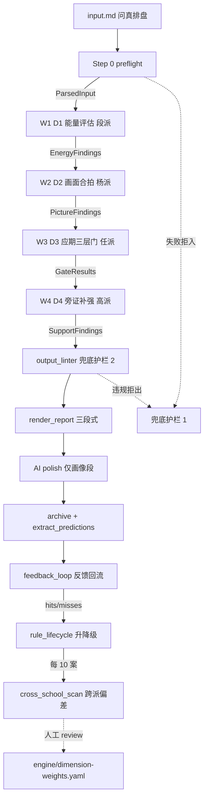
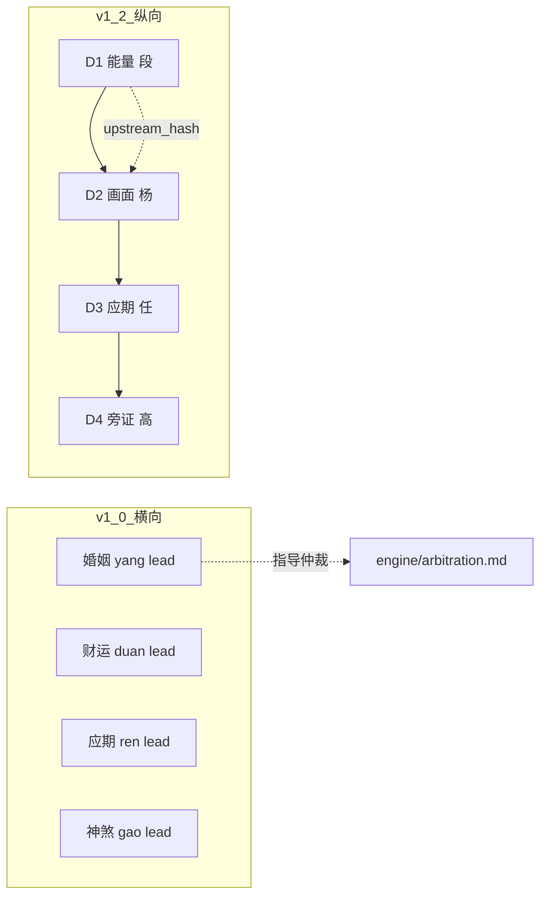
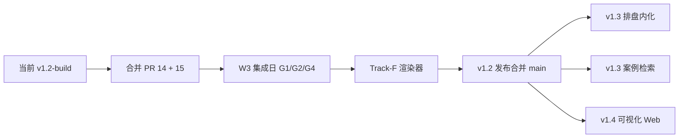

# mangpai-fusion 系统架构评审

> 站位：系统架构师 / 一次性给出 v1.0 → v1.2 重构现状的全景诊断 + 架构债务清单 + 演进路径建议。
> 撰写时间：2026-05-25
> 评审范围：整仓（截至 v1.2-build 分支 + PR #14/#15 待合状态）
> 依据文件：[`README.md`](../README.md)、[`STATUS.md`](../STATUS.md)、[`handoff.md`](../handoff.md)、[`engine/contracts/00-OVERVIEW.md`](../engine/contracts/00-OVERVIEW.md)、[`engine/contracts/07-pipeline-flow.md`](../engine/contracts/07-pipeline-flow.md)、[`engine/contracts/decisions-locked.md`](../engine/contracts/decisions-locked.md)、[`engine/pipeline.py`](../engine/pipeline.py)、[`engine/confidence.yaml`](../engine/confidence.yaml)、[`engine/arbitration.md`](../engine/arbitration.md)、[`.kiro/skills/analyst.md`](../.kiro/skills/analyst.md)、[`.kiro/skills/strategy.yaml`](../.kiro/skills/strategy.yaml)、[`theory/SCHEMA.md`](../theory/SCHEMA.md)、[`tools/cross_school_scan.py`](../tools/cross_school_scan.py)。

---

## 一、仓库本质：不是语料库，是"实战调用接口 + 自迭代反馈环"

[`README.md`](../README.md) 开篇就把定位钉死：**"本仓库不是研究语料库，而是面向命理师的实战调用接口"**。这是理解所有架构决策的总纲——

- 上游是**问真八字 APP 排盘**（决策 A 锁定为"自算干支大运 + 外部神煞"，见 [`engine/contracts/decisions-locked.md`](../engine/contracts/decisions-locked.md)），仓库不做排盘。
- 下游是**命理师与命主对话**，仓库不替代命理师判断（见 [`.kiro/skills/BOOT.md`](../.kiro/skills/BOOT.md)）。
- 中间是**4 派融合分析引擎 + 反馈回流校准引擎**——这才是仓库的全部价值所在。

承载它的有两套并存形态：
- **v1.0**：以 [`.kiro/skills/analyst.md`](../.kiro/skills/analyst.md) 为运行时入口，调用 [`engine/confidence.yaml`](../engine/confidence.yaml) + [`engine/arbitration.md`](../engine/arbitration.md) + [`engine/domain-weights.yaml`](../engine/domain-weights.yaml) 三份 YAML/MD 配置，由 LLM "解释执行"。
- **v1.2**：以 [`engine/pipeline.py`](../engine/pipeline.py) 为入口，把判定逻辑全部纯 Python 化（决策 B），分 D1-D4 四个维度引擎。

两套并存目前是**主动设计**，不是债务（v1.0 服务旧报告，v1.2 服务新案，见 [`engine/contracts/00-OVERVIEW.md`](../engine/contracts/00-OVERVIEW.md)）。

---

## 二、v1.0 → v1.2 的范式跃迁：从"权重平铺"到"维度立体"

这是整仓最关键的架构动作，[`engine/contracts/00-OVERVIEW.md`](../engine/contracts/00-OVERVIEW.md) 一句话点破：

> v1.0 把 4 派**平铺**为领域权重矩阵（婚姻/财运/职业…）。
> v1.2 把 4 派**立体化**为维度引擎。

| 版本 | 组织维度 | 调用方式 | 4 派关系 |
|---|---|---|---|
| v1.0 | 9 大领域 × 4 派权重 | LLM 读 YAML 解释执行 | 横向竞争（lead/co/audit）|
| v1.2 | D1→D2→D3→D4 串行流水线 | 纯 Python 函数调用 | 纵向依赖（D1 决定 D2 边界，D2 决定 D3 边界）|

v1.2 的核心断言（[`engine/contracts/00-OVERVIEW.md`](../engine/contracts/00-OVERVIEW.md)）：

> D1 是底层——D2 必须以 D1 输出为约束；D3 必须以 D1+D2 输出为约束；D4 横向补强。

这一改造把"4 派如何融合"的问题从**仲裁权重**（v1.0：谁说了算）改成了**串联约束**（v1.2：上游限定下游边界）。例如 D1 判定为"小富"，D2 就不能输出"千万级收入画面"（[`engine/contracts/07-pipeline-flow.md`](../engine/contracts/07-pipeline-flow.md)）。这是从**经验加权**走向**理论一致性约束**的跃迁。

---

## 三、v1.2 流水线全景：3+1 维度 + 双层护栏



四个维度引擎的**职责边界与代码锚点**：

| 维度 | 派别 | 入口 | 子模块 | 核心产物 |
|---|---|---|---|---|
| **D1 能量** | 段（lead）| [`engine/energy/evaluator.py`](../engine/energy/evaluator.py) `evaluate_energy()` | tiyong / zuogong / shidang / zeishen | `EnergyFindings.layer_count ∈ [0,4]`、`wealth_ceiling` |
| **D2 画面** | 杨（lead）| [`engine/picture/matcher.py`](../engine/picture/matcher.py) `match_picture()` | wuhe / wubu / anyin / marriage / caifu / tiaohou | `PictureFindings.{marriage,career,education}_picture` |
| **D3 应期** | 任（lead）| [`engine/yingqi/gate.py`](../engine/yingqi/gate.py) `gate_yingqi()` | keys / threelayer / chufa(6 触发) / menshu(12 道门) | `GateResult.passed_layers ∈ [0,3]` |
| **D4 旁证** | 高（lead）| [`engine/pangzheng/pangzheng.py`](../engine/pangzheng/pangzheng.py) `support_with_shensha()` | shensha_lib / loader / support | `SupportFindings`（神煞/健康/灾厄/词馆）|

每一步都是**纯函数 + 落盘**：输入 ParsedInput → 输出 dataclass → 写 `cases/C-XXX/findings/{stage}.json`，下一步用 `upstream_hash` 校验上游一致性（[`engine/contracts/07-pipeline-flow.md`](../engine/contracts/07-pipeline-flow.md)）。这是把"LLM 黑盒"改造成"可追溯白盒"的关键工程动作。

**灵魂条款**在 [`engine/contracts/04-gate-protocol.md`](../engine/contracts/04-gate-protocol.md)：

> 原局有 + 大运到位 + 流年引爆 = 三层齐备 → 铁口断 ★★★★★

任何 ★5 断语必须 `passed_layers == 3`，否则**强制降级**——这是把"应期可证伪"从铁律 5 真正写进代码护栏。

---

## 四、三层治理设计：契约 / 护栏 / 自迭代

仓库最有架构成色的部分，是把"AI 系统的不确定性"用工程手段层层收敛：

### 治理层 1：契约（Contracts）

[`engine/contracts/`](../engine/contracts/) 下 10 份 MD 是 v1.2 重构的"宪法"：

- 00 OVERVIEW（架构总览）
- 01 input-schema（preflight 11 步校验）
- 02 predicate-library（谓词库，跨 D1-D4 共享）
- 03 findings-schema（4 个 dataclass 的字段约束）
- 04 gate-protocol（三层门 + 6 触发，Track-C 宪法）
- 05 rule-lifecycle（candidate/promoted/retired/frozen 四态）
- 06 confidence-model（置信度公式）
- 07 pipeline-flow（本文 § 三依据）
- 08 agent-handoff（多 agent 协作协议）
- 09 naming-convention（命名规范）
- decisions-locked（13 项 A-M 决策红线）

价值：**所有 agent（人类 + LLM）必须先读契约再写代码**。修改契约要 PR + 整合 agent 批准，影响 ≥3 个 Track 必须暂停所有作业 1 天（[`engine/contracts/00-OVERVIEW.md`](../engine/contracts/00-OVERVIEW.md)）。

### 治理层 2：双护栏（Guardrails）

| 护栏 | 位置 | 阻断点 | 检查项 |
|---|---|---|---|
| **#1 preflight** | [`tools/preflight.py`](../tools/preflight.py) | 入口前 | 11 步 schema 校验，失败拒入流水线 |
| **#2 output_linter** | [`tools/output_linter.py`](../tools/output_linter.py) | 报告出口前 | 双轨置信度 / 派别标签 / 可证伪 / 黑名单 |
| **#3 three_layer_check** | [`tools/three_layer_check.py`](../tools/three_layer_check.py) | W3 内部 | ★5 必须 passed_layers=3 |

护栏是**进出门检**而非内部逻辑，违规直接中断流水线（[`engine/contracts/07-pipeline-flow.md`](../engine/contracts/07-pipeline-flow.md)）。

### 治理层 3：自迭代闭环（Self-Calibration）

```
案例反馈 → feedback_loop.py 重算 hit_rate
       → rule_lifecycle.py 升降级（决策 F：升自动+降人工）
       → 每 10 案触发 cross_school_scan.py（决策 K）
       → 跨派系统性偏差报告 → META/conflict-trends.md
       → 架构师人工 review → PR 修 dimension-weights.yaml
       → drift_detect.py 监控置信度漂移
```

注意 [`tools/cross_school_scan.py`](../tools/cross_school_scan.py) 的明确边界：**不自动调权重，只生成报告**。这是对"AI 自我修改"的关键克制——把"发现偏差"和"修正偏差"严格分离，前者自动化，后者必须人工 PR。

---

## 五、置信度模型：双轨制 + 切换路径

[`engine/confidence.yaml`](../engine/confidence.yaml) 定义的 v1.0 公式：

```
final_score = 0.4 × static_score + 0.6 × dynamic_score
当 hits + misses < 3 时，退回 static_score（防小样本污染）
```

权重选 **静态:动态 = 4:6** 的理由：用户偏好"宁慢不假"，实战应验高于纸面理论（[`STATUS.md`](../STATUS.md)）。

[`engine/contracts/decisions-locked.md`](../engine/contracts/decisions-locked.md) 的关键设计——**置信度模型自动演进**：

| 阶段 | 公式 | 触发条件 |
|---|---|---|
| W2-W4（当前）| 线性加权 `posterior = primary + trigger_bonus + type_bonus` | 默认 |
| W5+ | Beta 分布 `(hits+1)/(hits+misses+2)` | 反馈样本 ≥ 30 时由 Track-G 自动切换 |

把"置信度算法本身的演进"也纳入自迭代闭环，是这套设计的精巧之处。

---

## 六、4 派分工的两套表达（领域权重 vs 维度引擎）

两套表达在仓库中**共存**，各自服务不同场景：



观察到的设计意图：
- v1.0 的领域权重保留下来作为**仲裁兜底**（[`engine/arbitration.md`](../engine/arbitration.md)），处理"D1-D4 都没覆盖到的领域问题"。
- v1.2 的维度引擎处理**主流水线 6 大领域**（婚/事/财/学/健/六亲）。

风险点：两套权重表达**没有形式化对齐**，比如某天调整了 [`engine/domain-weights.yaml`](../engine/domain-weights.yaml)，[`engine/yingqi/keys.py`](../engine/yingqi/keys.py) 里硬编码的 `domain → primary 十神` 映射不会同步。

---

## 七、当前架构债务与风险

### 债务 1：v1.2 W3 集成日未完成（最高优先级）

[`tests/regression/test_v1_2_vs_v1_0.py`](../tests/regression/test_v1_2_vs_v1_0.py) 中 G1/G2/G4 三个回归测试是 TODO 占位（[`handoff.md`](../handoff.md)），导致 **3 failed** 持续存在。这是**发布门槛**（决策 I），不解决就出不了 v1.2。

### 债务 2：Track-F 报告渲染器未启动

[`tools/render_report.py`](../tools/render_report.py) 已存在但 [`templates/report-v1.2.md`](../templates/report-v1.2.md) 待建（[`handoff.md`](../handoff.md)）。三段式（铁断/画像/应期）的"AI polish 边界"决策 D 锁定为"仅画像段允许润色，必须标 `[AI-polish]`"，这个边界靠 Track-F 落地。

### 债务 3：v1.0 / v1.2 双轨长期共存的对齐成本

- [`.kiro/skills/analyst.md`](../.kiro/skills/analyst.md) 仍是 v1.0 LLM 解释执行版本，没有指向 v1.2 流水线。
- [`engine/confidence.yaml`](../engine/confidence.yaml) 是 v1.0 双轨制公式，[`engine/yingqi/gate.py`](../engine/yingqi/gate.py) 的 `compute_yingqi_confidence` 是 v1.2 公式，**两者数学形态不同**。
- 反馈回流目前主要喂 v1.2 引擎，v1.0 的 `theory/{school}/index.yaml` 也在被 [`tools/cross_school_scan.py`](../tools/cross_school_scan.py) 读取——存在**反馈数据所有权模糊**。

### 债务 4：决策 B "纯 Python" 边界容易滑坡

[`engine/contracts/decisions-locked.md`](../engine/contracts/decisions-locked.md) 明确禁止"YAML 表达判定逻辑"，但 [`engine/mechanical-rules.yaml`](../engine/mechanical-rules.yaml) 是否有混入风险？需要专项审查。

### 债务 5：trace_id 100% 覆盖（G5）依赖 Track-F

每条断语含 `evidence.rule_id` 链是 v1.2 发布门槛之一（[`handoff.md`](../handoff.md)），但目前 D1-D4 各自填 `evidence` 字段的格式还没有强制对齐——靠 Track-F 渲染时反向倒推。

### 债务 6：理论库覆盖率与跨派映射

[`STATUS.md`](../STATUS.md) 自承："4 派 914 条规律全量索引 + 仅 27% 跨派映射（按需扩充）"。意味着 73% 规律仍是孤岛，互补层和共识层的发现要靠每 10 案的 `cross_school_scan` 慢慢长出来。这是**主动接受的债**，不是失误。

### 债务 7：可观测性缺失

性能约束（[`engine/contracts/07-pipeline-flow.md`](../engine/contracts/07-pipeline-flow.md)）端到端 < 60s，但没有看到 metrics/tracing 接入，目前靠 `--verbose` 打印。一旦案例量上来，定位"哪一步卡住"会很费劲。

---

## 八、推荐演进路径



| 阶段 | 关键交付 | 验收 |
|---|---|---|
| **P0 立即** | 合并 PR #14 / #15 → 切 `v1.2-track-F` | pytest 64 passed |
| **P1 短期** | W3 集成日把 G1/G2/G4 真值接入 + Track-F 三段式渲染 | G1-G6 全部满足决策 I 的发布门槛 |
| **P2 中期** | v1.2 → main 发布；启动 Track-J 反馈累积 | ≥30 反馈样本，触发 Beta 分布切换 |
| **P3 长期** | 命宫长生诀自动算法（[`STATUS.md`](../STATUS.md)）+ 问真 APP 直接解析 + 八字指纹相似案检索 | v1.0 ROADMAP 三大未做项 |

### 给架构师的 5 条具体建议

1. **把 [`.kiro/skills/analyst.md`](../.kiro/skills/analyst.md) 改造为"v1.2 流水线编排器"**：让它调用 [`engine/pipeline.py`](../engine/pipeline.py) 的 `run_pipeline()` 而不是自己解释 YAML，统一入口。
2. **统一 trace_id 规范到 [`engine/contracts/03-findings-schema.md`](../engine/contracts/03-findings-schema.md)**：在 D1-D4 的 dataclass 里把 `evidence.rule_id` 提为必填，Track-F 落地前先把契约钉死。
3. **建立 v1.0 ↔ v1.2 的反馈数据 ETL**：让 `theory/{school}/index.yaml` 的 `applied_cases` 与 `cases/C-XXX/feedback.md` 单向同步（feedback → index），避免双写。
4. **加入轻量 metrics**：[`engine/pipeline.py`](../engine/pipeline.py) 每步落盘时同时写 `cases/C-XXX/findings/timing.json`，记录 8 步耗时；超 60s 阈值告警。
5. **冻结 [`engine/mechanical-rules.yaml`](../engine/mechanical-rules.yaml) 审查**：开一个一次性 PR 把所有"含判定语义"的字段挪到 Python，YAML 只留 metadata 和阈值表，彻底落地决策 B。

---

## 九、一句话总结

mangpai-fusion 是一套**把传统命理知识用现代软件工程治理起来的实验**：用契约约束 LLM、用护栏拒绝越界输出、用自迭代回流校准置信度、用纯 Python 取代 YAML 表达判定逻辑。v1.2 重构正处在"99% 完成、缺 W3 集成日 + Track-F 渲染器"的临门一脚阶段，下一步是把规划好的发布门槛走完，然后把 v1.0 的 LLM 解释入口改造成 v1.2 流水线的编排层，结束双轨长期共存的对齐成本。

---

## 附录 A：评审检查表（团队 review 用）

- [ ] § 三 流水线全景图与 [`engine/contracts/07-pipeline-flow.md`](../engine/contracts/07-pipeline-flow.md) 一致
- [ ] § 四 三层治理设计准确反映 contracts / guardrails / self-calibration
- [ ] § 七 7 项债务全部认可，且优先级一致
- [ ] § 八 P0/P1/P2/P3 阶段划分被 owner 确认
- [ ] 5 条建议中有人 own 每一条，PR 标题前缀符合 [`engine/contracts/decisions-locked.md`](../engine/contracts/decisions-locked.md) 的 `[CONTRACT]` / `[DECISION]` 规范

---

## 附录 B：变更记录

| 版本 | 时间 | 修改 |
|---|---|---|
| v1.0 | 2026-05-25 | 架构师首次评审，覆盖 v1.2-build 当前状态 |
