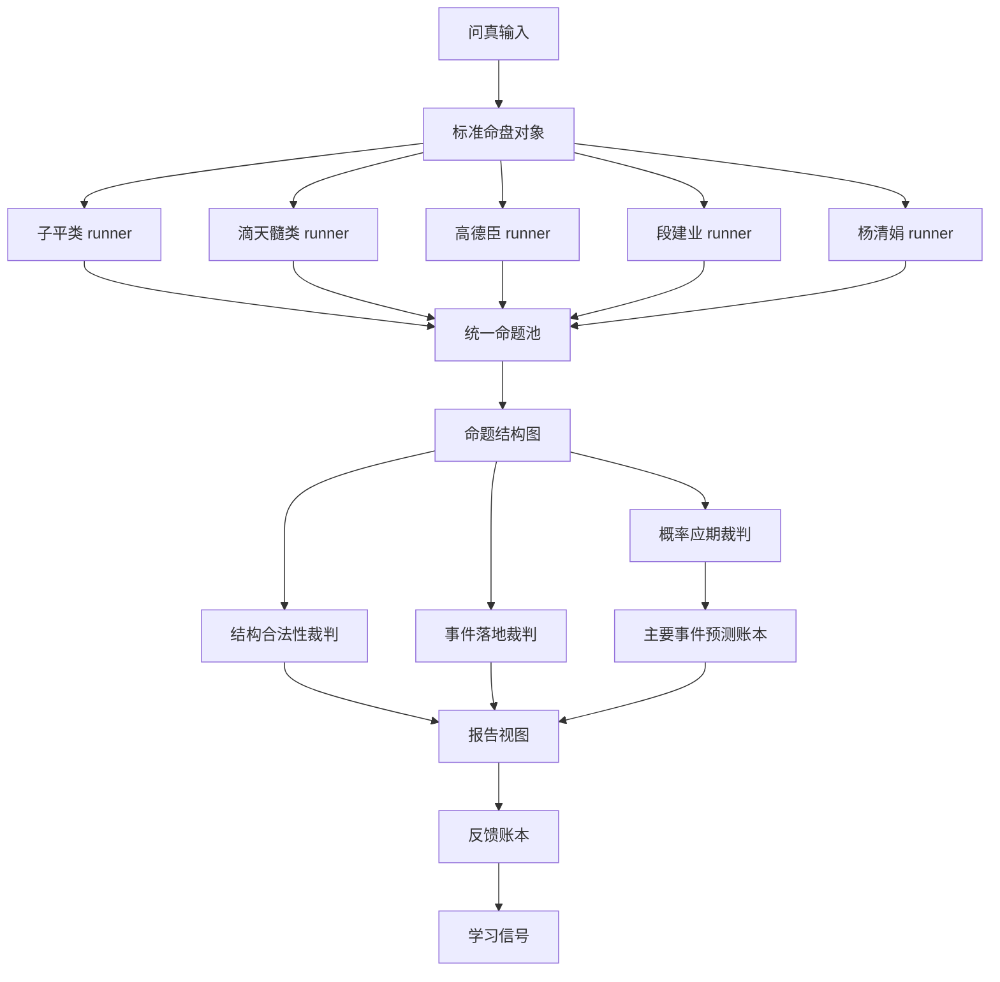

# 格局判断：八字分析流程与方法大胆重构方案

## Thesis

当前系统不该继续围绕旧 D1-D4 串行维度引擎扩展，而应把新五派并行裁判升级为正式主流程：同一命盘先由五派独立产生命题，再进入结构图、三段式仲裁、主要事件预测账本、报告与反馈闭环。旧 D1-D4 只能作为三盲派 runner 的内部素材库，不再拥有主流程编排权；主要事件必须先给出可反馈预测，再用反馈纠正和学习。

## Confidence

- **Confidence level**: high
- **Why not certain**: 仓库已有新核心契约，但 [`engine/v5/`](../engine/v5/) 当前只看到最小目录，是否已具备足够 runner 能力还需实现模式检查；此外 [`tools/render_report.py`](../tools/render_report.py) 的正式出口仍可能耦合旧 [`AnalysisOutput`](../engine/contracts/07-pipeline-flow.md:9)。

## The Trap

- **Inherited constraint**: 旧流程把八字分析固化为 [`ParsedInput`](../engine/contracts/10-ziping-fusion-v5.md:11) → D1 段派能量 → D2 杨派画面 → D3 任派应期 → D4 高派旁证 → 报告。
- **Is it real?**: partially
- **Why**: 输入归档、报告归档、反馈索引、展示层禁显是产品契约，必须保留；但 D1-D4 串行顺序、上游消费下游的依赖链、旧 [`AnalysisOutput`](../engine/contracts/07-pipeline-flow.md:9) 形态只是内部实现，不是用户承诺。

## High-格局 Direction

目标模型是“命理推理操作系统”，不是“四个模块顺序跑一遍”。正式主流程改为：

```text
问真输入
  → 标准命盘对象
  → 五派独立 runner
  → 统一命题协议
  → 命题结构图
  → 三段式裁判
  → 主要事件 prediction ledger
  → 可反馈报告视图
  → statement ledger
  → learning signal
```

五派是：子平类、滴天髓类、高德臣、段建业、杨清娟。每派只读取同一命盘输入，不读取其他派中间结论；每派只输出统一命题；裁判器负责结构合法性、事件落地、概率应期三段裁决。凡属于事业变动、财富起落、婚恋变化、健康风险、学业升降、家庭六亲等主要事件，必须进入预测账本，先给出事件标签、时间窗、触发条件、置信度和可证伪反馈口径；后续反馈再纠正学习。这个方向直接承接已有 [`V5Claim`](../engine/contracts/10-ziping-fusion-v5.md:57)、[`StructureGraph`](../engine/contracts/10-ziping-fusion-v5.md:89)、[`ArbitrationResult`](../engine/contracts/10-ziping-fusion-v5.md:101)、[`PredictionLedger`](../engine/contracts/10-ziping-fusion-v5.md:119)、[`LearningSignal`](../engine/contracts/10-ziping-fusion-v5.md:134) 契约。



## Frame-Opening Move

- **Move used**: zero-legacy thought experiment + kill the wrong concept
- **What it reveals**: 如果今天从零设计，没人会让“段派能量先跑完，杨派才能说话，任派只能消费前两者，高派最后补强”成为命理判断总框架。那是旧实现的顺序，不是八字分析的方法论。应删除“串行维度主流程”这个错误概念，保留其可复用能力。

## Bold Takes

- **删除主流程里的 D1-D4 串行权威**：D1-D4 不再是正式推理骨架，只是三盲派 runner 内部工具箱。
- **删除平权投票幻想**：五派不是少数服从多数；子平和滴天髓掌结构合法性，三盲派掌事件落地，任系应期能力应被吸收为 timing enhancer，而不是继续作为独立主流程节点。
- **合并报告出口**：报告只消费裁判后的 domain verdict，不再直接拼接 energy、picture、gate、support findings。
- **拆分置信度**：命题置信度、裁判置信度、事件概率、反馈可信度必须分开，不能继续用一个星级口径包打天下。
- **主要事件 prediction-first**：重大事件不允许只写倾向性画像；必须先形成可反馈预测，哪怕置信度较低，也要明确“不足以铁断”的时间窗、触发条件和反证口径。
- **重命名系统心智模型**：从“盲派四派融合系统”升级为“五派命理推理与裁判系统”；盲派是强事件落地专家组，但不再垄断结构底盘。

## Options

| Option | What it optimizes | Cost | Verdict |
|---|---|---|---|
| Conservative path | 保留旧 [`run_pipeline()`](../engine/README.md:9)，把新裁判作为附加段落 | 继续双主线、旧输出耦合越来越重 | reject，仅可用于短期对照验证 |
| Clean target | 直接让 [`engine/v5/`](../engine/v5/) 成为正式入口，旧 D1-D4 从主流程删除 | 需要重写报告视图、反馈索引和工具入口 | recommended，目标模型最干净 |
| Staged clean path | 先并行跑新主流程，验收通过后切正式入口并废弃旧主流程 | 多一段双跑和对照成本 | recommended，落地风险最低 |

## New Method: 十五层域内判断法

每个主要领域不再由单派单段断语输出，而由固定十五层判断组成：

| 层 | 判断对象 | 主责 |
|---|---|---|
| 1 | 原局结构能否承载此领域 | 子平类、滴天髓类、高德臣 |
| 2 | 月令与气候是否支持 | 子平类、滴天髓类 |
| 3 | 用忌与病药是否清晰 | 子平类、滴天髓类 |
| 4 | 做功路径是否成立 | 高德臣、段建业 |
| 5 | 十神与宫位是否落地 | 段建业、杨清娟 |
| 6 | 现实事件类型是什么 | 高德臣、段建业、杨清娟 |
| 7 | 人物关系与生活画面 | 杨清娟、段建业 |
| 8 | 正向证据链 | 五派共同输出 |
| 9 | 反证与降级条件 | 子平类、滴天髓类、高德臣 |
| 10 | 跨派冲突类型 | 裁判器 |
| 11 | 结构裁决 | 结构裁判器 |
| 12 | 事件裁决 | 事件裁判器 |
| 13 | 应期与触发条件 | 概率应期裁判器、任系 enhancer |
| 14 | 主要事件预测登记 | prediction ledger、概率白名单与反馈 taxonomy |
| 15 | 最终可反馈断语 | 报告视图、statement ledger、learning signal |

这十五层不是报告章节编号，而是内部生成每条领域判断的最小审计链；报告只展示“判断结果｜证据链｜置信度｜应期”，内部 ledger 保留层级来源。

## Target Flow Contracts

1. **Input layer**: 保留问真输入和 preflight，产出唯一标准命盘对象；旧 [`ParsedInput`](../engine/contracts/10-ziping-fusion-v5.md:11) 可演进为 chart DTO。
2. **School runner layer**: 五派 runner 并行执行，每个 runner 输出 [`V5Claim`](../engine/contracts/10-ziping-fusion-v5.md:57)，不得输出自然语言报告。
3. **Graph layer**: 所有命题进入 [`StructureGraph`](../engine/contracts/10-ziping-fusion-v5.md:89)，用边表达 support、weakens、conflicts、timed_by、prerequisites。
4. **Adjudication layer**: 每个领域必须输出三段 [`ArbitrationResult`](../engine/contracts/10-ziping-fusion-v5.md:101)：结构合法性、事件落地、概率应期。
5. **Report ViewModel layer**: 新增报告视图对象，只接收裁判结果，不接收 runner 原始中间态。
6. **Statement ledger layer**: 替代旧 statement index 心智模型，记录 domain、layer、claim、school、rule、verdict target、feedback state。
7. **Prediction-first layer**: 主要事件必须先写入 [`PredictionLedger`](../engine/contracts/10-ziping-fusion-v5.md:119)，字段至少包括 domain、event_label、probability_range、confidence、time_window、trigger_conditions、falsifier、feedback_state。
8. **Learning layer**: 反馈先形成 [`LearningSignal`](../engine/contracts/10-ziping-fusion-v5.md:134)，小样本不自动改核心规则；但允许更新事件预测的命中、失验、半命中、时间偏差与校准备注。

## What Not To Do

- 不要把新五派结果继续挂到旧 integration 的附属字段里；那会让新主流程永远只是 sidecar。
- 不要保留旧 D1-D4 顺序作为“兼容模式默认路径”；没有外部 API 承诺时，内部调用应直接迁移。
- 不要让报告模板直接读取 runner findings；报告必须只读取裁判后 ViewModel。
- 不要把所有判断都概率化；性格、格局层次、宽泛画像默认只给置信度，不给事件概率。
- 不要让规则数量决定派别权重；已有 Phase-300 策略说明子平与滴天髓需要 lane 内归一化，不能被规则数量压制。

## First Proof Point

最小证明物不是完整重构，而是选一个已归档案例跑出新主流程的“六大领域 × 十五层判断 × 三段裁判 × 主要事件预测账本”结构化 JSON，并从它渲染一份正式统一报告。该证明必须展示：五派独立命题、结构图冲突、三段裁决、主要事件预测、报告不泄露内部 ID、反馈 ledger 可追踪。

## Falsifier

如果连续抽取已反馈案例后发现：五派 runner 无法产生足够独立命题、裁判结果无法稳定映射到可反馈断语、主要事件预测大量无法定义反馈口径、或新流程在六大领域覆盖率低于旧流程，那么“直接废弃旧 D1-D4 主流程”的 thesis 需要降级为 staged clean path，并保留旧流程作为临时 fallback。

## Execution Todo List

- [ ] 新建或修订 v6 正式主流程契约，声明新五派并行裁判取代旧 D1-D4 主流程。
- [ ] 定义 chart DTO、school runner 接口、claim schema、graph schema、domain verdict schema、report view schema、statement ledger schema。
- [ ] 把 [`engine/v5/`](../engine/v5/) 从 sidecar 提升为正式入口，并提供 run case 的单一 API。
- [ ] 为子平类、滴天髓类、高德臣、段建业、杨清娟分别实现最小 runner，占位 runner 必须显式 abstain。
- [ ] 将旧 [`engine/energy/`](../engine/README.md:12)、[`engine/picture/`](../engine/README.md:13)、[`engine/yingqi/`](../engine/README.md:14)、[`engine/pangzheng/`](../engine/README.md:15) 能力改挂到对应 runner 内部，不再由主流程串联。
- [ ] 实现结构图构建器，按 domain、claim type、evidence、conflict、timing 建边。
- [ ] 实现三段式裁判器：结构合法性、事件落地、概率应期。
- [ ] 实现十五层域内判断生成器，覆盖学业、事业、财富、婚姻、健康、性格、总体。
- [ ] 实现主要事件 prediction-first 账本：事业变动、财富起落、婚恋变化、健康风险、学业升降、家庭六亲等事件必须先出预测结果，再等待反馈校准。
- [ ] 新建 report ViewModel，改造报告渲染为只消费 domain verdict 与主要事件 prediction ledger。
- [ ] 新建 statement ledger，替代旧 statement index 的主心智模型，同时保留必要迁移适配。
- [ ] 改造反馈摄入，把反馈映射到 claim、school、domain、layer、rule、event taxonomy 与 prediction_id，并记录命中、失验、半命中、时间偏差。
- [ ] 增加对照验收：同一案例旧流程与新流程并跑，比较覆盖率、冲突解释力、反馈可追踪性。
- [ ] 切换正式入口，废弃旧 D1-D4 主流程默认调用，仅保留短期回归对照命令。

## Recommended Verdict

采用 **Staged clean path** 执行，但目标按 **Clean target** 设计。也就是说，架构决策上确认“新五派并行裁判是正式主流程”，工程落地上允许短期并跑验证；不要把短期并跑误写成长期双轨兼容。