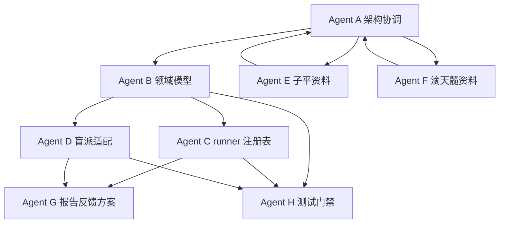

# 多 Agent 并行执行方案

> 适用场景：用户将启动多个 VSCode 窗口，由多个 AI agent 并行推进“多流派并行功能域分析与裁判模型”落地。本文定义角色边界、输入输出、依赖顺序、冲突规避与交付验收，避免多个窗口同时修改同一文件造成覆盖、重复设计或事实源漂移。

---

## 1. 总目标

围绕 [`plans/parallel-domain-voting-architecture.md`](parallel-domain-voting-architecture.md) 的目标架构，将当前 D1-D4 串行引擎逐步扩展为：

```text
ParsedInput
  → 功能域调度
  → 盲派专家组 reading
  → 子平格局派 reading
  → 滴天髓调候派 reading
  → 裁判模型 adjudication
  → 报告与反馈索引
```

本轮多 agent 并行的核心目标不是一次性切换生产流程，而是完成可并行推进的基础设施、资料入口、理论提取、schema、旁路模型、测试与文档对齐。

---

## 2. 全局协作原则

1. **单文件单 owner**
   同一时间只允许一个 agent 修改同一个文件。若必须跨 agent 修改，应先在本方案中登记 owner，再由 owner 统一合并。

2. **先旁路，后切换**
   不直接替换 [`engine/application/pipeline_runner.py`](../engine/application/pipeline_runner.py) 默认主流程；新增能力优先作为旁路模型、旁路 runner、旁路测试存在。

3. **流派隔离**
   子平格局派、滴天髓调候派、盲派专家组不得共享内部中间态。跨流派交互只能通过统一外部协议 `ExpertReading`。

4. **所有新增结论必须可追溯**
   规则、断语、reading、adjudication 都要能追踪到 rule id、source path、expert system、domain、feedback target。

5. **低样本不下结论**
   反馈统计只能作为动态权重输入之一；在 `n_eff` 不足时不得形成“某派最准”的确定性结论。

6. **架构文档是本轮并行协作合同**
   架构判断以 [`plans/parallel-domain-voting-architecture.md`](parallel-domain-voting-architecture.md) 与本文为准；版本、工具、项目状态仍以 [`AGENTS.md`](../AGENTS.md) 与 [`META/project-state.json`](../META/project-state.json) 为准。

---

## 3. 推荐窗口与 Agent 分工

### Agent A：架构协调与契约 owner

| 项目 | 内容 |
|---|---|
| 建议窗口 | VSCode 窗口 A |
| 主要目标 | 维护整体方案、schema 契约、任务拆分、跨 agent 合并原则 |
| 主要输入 | [`plans/parallel-domain-voting-architecture.md`](parallel-domain-voting-architecture.md)、[`AGENTS.md`](../AGENTS.md)、[`META/project-state.json`](../META/project-state.json) |
| 主要输出 | 架构文档更新、领域模型契约草案、合并检查清单 |
| 允许修改 | [`plans/`](./)、必要时新增 `engine/contracts/` 文档草案 |
| 禁止修改 | 不直接改生产引擎、不直接改报告渲染、不直接改反馈摄入逻辑 |

建议任务：

1. 维护本文与主架构文档一致性。
2. 明确 `ExpertReading`、`ExpertJudgement`、`AdjudicationResult`、`DomainAnalysis` 的字段边界。
3. 审核其他 agent 输出是否破坏流派隔离。
4. 汇总最终合并顺序与验收清单。

---

### Agent B：领域模型与裁判模型 owner

| 项目 | 内容 |
|---|---|
| 建议窗口 | VSCode 窗口 B |
| 主要目标 | 实现旁路多专家领域模型与裁判模型骨架 |
| 主要输入 | [`plans/parallel-domain-voting-architecture.md`](parallel-domain-voting-architecture.md) 第 5、8、10 节 |
| 主要输出 | `engine/domain/parallel.py`、`engine/application/adjudication.py`、对应单元测试 |
| 允许修改 | `engine/domain/parallel.py`、`engine/application/adjudication.py`、`tests/test_parallel_domain_models.py`、`tests/test_adjudication.py` |
| 禁止修改 | 不改 [`tools/render_report.py`](../tools/render_report.py)，不改 [`tools/feedback_ingest.py`](../tools/feedback_ingest.py)，不改各派具体 analyzer |

建议任务：

1. 新增不可变或可序列化的领域模型。
2. 实现最小裁判公式：
   ```text
   adjusted_score = raw_score × prior_domain_weight × confidence_weight × feedback_weight × evidence_quality_weight - conflict_penalty
   ```
3. 支持 `abstain`、`mixed`、`timing_only`。
4. 用 mock reading 验证裁判结果。

交付边界：只产出模型与纯函数，不接入生产 pipeline。

---

### Agent C：并行功能域 runner 与注册表 owner

| 项目 | 内容 |
|---|---|
| 建议窗口 | VSCode 窗口 C |
| 主要目标 | 实现旁路 `parallel_domain_runner` 与 analyzer registry |
| 主要输入 | Agent B 的领域模型、现有 [`engine/application/pipeline_runner.py`](../engine/application/pipeline_runner.py) |
| 主要输出 | `engine/application/parallel_domain_runner.py`、`engine/application/domain_analyzers.py`、对应测试 |
| 允许修改 | `engine/application/parallel_domain_runner.py`、`engine/application/domain_analyzers.py`、`tests/test_parallel_domain_runner.py` |
| 禁止修改 | 不改默认 `run_pipeline()`，不改报告模板，不改规则库 |

建议任务：

1. 定义 analyzer 协议：输入 `parsed + domain + context`，输出 `ExpertReading` 或 `abstain`。
2. 定义注册表：`expert_system + domain -> analyzer`。
3. 用 mock analyzer 跑通：婚姻、财富两个域。
4. 确保默认生产流程不变。

交付边界：只作为旁路 runner，可被测试调用，不被默认报告调用。

---

### Agent D：盲派专家组适配 owner

| 项目 | 内容 |
|---|---|
| 建议窗口 | VSCode 窗口 D |
| 主要目标 | 把现有段、杨、任、高 findings 包装为盲派专家组 reading |
| 主要输入 | [`engine/energy/`](../engine/energy/)、[`engine/picture/`](../engine/picture/)、[`engine/yingqi/`](../engine/yingqi/)、[`engine/pangzheng/`](../engine/pangzheng/) |
| 主要输出 | 盲派 adapter 方案或旁路 adapter 代码、测试样例 |
| 允许修改 | `engine/application/blind_expert_adapter.py`、`tests/test_blind_expert_adapter.py` |
| 禁止修改 | 不重写 D1-D4 内部逻辑，不改变现有 findings schema，不改变 integration 默认行为 |

建议任务：

1. 先选婚姻或财富域。
2. 将现有 findings 转换为 `ExpertReading`。
3. 对任派应期类输出允许使用 `timing_only`。
4. 对高派旁证类输出要区分 support、oppose、abstain。

交付边界：只包装，不重构原四派引擎。

---

### Agent E：子平格局派资料与规则抽取 owner

| 项目 | 内容 |
|---|---|
| 建议窗口 | VSCode 窗口 E |
| 主要目标 | 接收子平格局派原始教案并提取候选规则 |
| 主要输入 | [`sources/ziping/`](../sources/ziping/)、[`templates/theory-extraction-template.md`](../templates/theory-extraction-template.md) |
| 主要输出 | `theory/ziping/index.yaml` 候选规则草案、提取说明 |
| 允许修改 | [`sources/ziping/`](../sources/ziping/)、`theory/ziping/index.yaml`、`theory/raw/ziping/`、提取记录文档 |
| 禁止修改 | 不改盲派 theory，不直接改 engine，不把候选规则标为 confirmed |

建议任务：

1. 等用户投放原始教案后再提取。
2. 使用 [`templates/theory-extraction-template.md`](../templates/theory-extraction-template.md) 保留原文摘录。
3. 规则初始状态统一为 `candidate`。
4. 每条规则必须有 source path 与可证伪条件。

交付边界：只做资料和候选规则，不做可执行 analyzer。

---

### Agent F：滴天髓调候派资料与规则抽取 owner

| 项目 | 内容 |
|---|---|
| 建议窗口 | VSCode 窗口 F |
| 主要目标 | 接收滴天髓调候派原始教案并提取候选规则 |
| 主要输入 | [`sources/tiaohou_ditiansui/`](../sources/tiaohou_ditiansui/)、[`templates/theory-extraction-template.md`](../templates/theory-extraction-template.md) |
| 主要输出 | `theory/tiaohou_ditiansui/index.yaml` 候选规则草案、提取说明 |
| 允许修改 | [`sources/tiaohou_ditiansui/`](../sources/tiaohou_ditiansui/)、`theory/tiaohou_ditiansui/index.yaml`、`theory/raw/tiaohou_ditiansui/`、提取记录文档 |
| 禁止修改 | 不改子平 theory，不直接改 engine，不把候选规则标为 confirmed |

建议任务：

1. 等用户投放原始教案后再提取。
2. 重点抽取寒暖燥湿、病药、调候用神、健康与性格映射。
3. 规则初始状态统一为 `candidate`。
4. 每条规则必须有 source path 与可证伪条件。

交付边界：只做资料和候选规则，不做可执行 analyzer。

---

### Agent G：报告与反馈索引 owner

| 项目 | 内容 |
|---|---|
| 建议窗口 | VSCode 窗口 G |
| 主要目标 | 设计多专家裁判结果如何进入报告与 `statement_index.json` |
| 主要输入 | [`tools/render_report.py`](../tools/render_report.py)、[`tools/feedback_ingest.py`](../tools/feedback_ingest.py)、[`templates/report-v1.3.md`](../templates/report-v1.3.md) |
| 主要输出 | 报告区块方案、statement index 扩展方案、兼容性测试 |
| 允许修改 | 先写 `plans/report-feedback-parallel-extension.md`，后续经批准再改工具 |
| 禁止修改 | 在 Agent B/C 模型未稳定前，不直接改生产报告渲染和反馈摄入 |

建议任务：

1. 先形成文档方案，不立即改代码。
2. 设计 `reading_ids`、`adjudication_id`、`expert_systems`、`decision` 字段如何落入索引。
3. 保证旧 `statement_index.json` 兼容。
4. 设计 feedback fanout 到 rule、reading、adjudication 的策略。

交付边界：先文档化，等模型稳定后再实现。

---

### Agent H：测试与质量门禁 owner

| 项目 | 内容 |
|---|---|
| 建议窗口 | VSCode 窗口 H |
| 主要目标 | 维护并行开发期间的测试入口、回归范围与质量门禁 |
| 主要输入 | [`tests/`](../tests/)、[`tools/rule_status_scan.py`](../tools/rule_status_scan.py)、[`tools/tool_registry.py`](../tools/tool_registry.py) |
| 主要输出 | 测试清单、冒烟脚本建议、回归报告 |
| 允许修改 | `tests/` 中新增并行模型相关测试、`plans/testing-parallel-agent-checklist.md` |
| 禁止修改 | 不改业务实现，不改规则库，不改报告模板 |

建议任务：

1. 定义每个 agent 合并前必须运行的最小测试。
2. 增加模型、runner、adapter 的单元测试建议。
3. 保留当前 v1.3/v1.4 验收测试不被破坏。
4. 每轮合并后建议运行：
   ```cmd
   pytest tests\test_parallel_domain_models.py tests\test_parallel_domain_runner.py -q
   pytest tests\v1_3_acceptance -q
   python -m tools.rule_status_scan --format json
   ```

---

## 4. 并行依赖顺序



关键依赖：

1. Agent B 的模型字段必须先稳定，Agent C/D/G 才能实现或设计下游。
2. Agent E/F 可与 Agent B 并行，但只产出候选理论资料，不阻塞模型开发。
3. Agent G 初期只做方案，不应早于 Agent B/C 稳定前直接改生产工具。
4. Agent H 可全程并行，但测试用例需跟随 B/C/D 的最终命名。

---

## 5. 文件 ownership 建议

| 文件或目录 | Owner | 备注 |
|---|---|---|
| [`plans/parallel-domain-voting-architecture.md`](parallel-domain-voting-architecture.md) | Agent A | 总架构合同 |
| [`plans/multi-agent-parallel-plan.md`](multi-agent-parallel-plan.md) | Agent A | 本文件 |
| `engine/domain/parallel.py` | Agent B | 新领域模型 |
| `engine/application/adjudication.py` | Agent B | 裁判模型 |
| `engine/application/domain_analyzers.py` | Agent C | analyzer 协议与注册表 |
| `engine/application/parallel_domain_runner.py` | Agent C | 旁路 runner |
| `engine/application/blind_expert_adapter.py` | Agent D | 盲派专家组适配 |
| [`sources/ziping/`](../sources/ziping/) | Agent E | 子平原始资料入口 |
| `theory/ziping/index.yaml` | Agent E | 子平候选规则 |
| [`sources/tiaohou_ditiansui/`](../sources/tiaohou_ditiansui/) | Agent F | 滴天髓原始资料入口 |
| `theory/tiaohou_ditiansui/index.yaml` | Agent F | 滴天髓候选规则 |
| `plans/report-feedback-parallel-extension.md` | Agent G | 报告反馈扩展方案 |
| `tests/test_parallel_domain_models.py` | Agent B / H | B 初建，H 审核 |
| `tests/test_parallel_domain_runner.py` | Agent C / H | C 初建，H 审核 |
| `tests/test_blind_expert_adapter.py` | Agent D / H | D 初建，H 审核 |

---

## 6. 冲突规避策略

### 6.1 Git 与文件冲突

1. 每个 agent 开始前先确认自己只改 owner 文件。
2. 不要在多个窗口同时修改同一文件。
3. 若需要修改非 owner 文件，先在对应窗口停止，让 owner agent 接管。
4. 文档和代码不要混在同一 agent 中大范围修改。

### 6.2 架构冲突

若出现以下冲突，交给 Agent A 裁决：

- `ExpertReading` 字段是否新增或重命名。
- `expert_system` 枚举是否调整。
- `domain` 标准命名是否调整。
- `statement_index` 是否新增破坏兼容的字段。
- 动态权重是否允许影响默认报告输出。

### 6.3 规则状态冲突

若 Agent E/F 产生候选规则：

- 初始只能是 `candidate`。
- 不得手写 confirmed。
- 不得伪造 feedback 命中。
- 不得把同一条理论同时归入子平和滴天髓，除非明确作为 cross-expert relation 记录。

---

## 7. 推荐执行批次

### 批次 1：契约与旁路模型

Owner：Agent A、B、H。

交付：

1. 本并行方案稳定。
2. `engine/domain/parallel.py` 模型草案。
3. `engine/application/adjudication.py` 纯函数裁判骨架。
4. 模型与裁判测试。

### 批次 2：runner 与盲派适配

Owner：Agent C、D、H。

交付：

1. `domain_analyzers` 注册表。
2. `parallel_domain_runner` 可用 mock analyzer 跑通。
3. 婚姻或财富域盲派 adapter 第一版。
4. 保持默认 pipeline 不变。

### 批次 3：资料与规则候选

Owner：Agent E、F、A。

交付：

1. 子平原始资料入库。
2. 滴天髓原始资料入库。
3. 使用模板提取候选规则。
4. Agent A 审核是否满足流派隔离与可追溯要求。

### 批次 4：报告与反馈扩展方案

Owner：Agent G、A、H。

交付：

1. 多专家裁判报告区块方案。
2. `statement_index` 兼容扩展方案。
3. feedback fanout 到 rule/reading/adjudication 的方案。
4. 测试清单。

### 批次 5：集成试跑

Owner：Agent A 协调，B/C/D/G/H 配合。

交付：

1. 用 mock 或单域真实 adapter 形成 `DomainAnalysis`。
2. 输出不进入默认报告，只作为旁路结果。
3. 完成回归测试。
4. 决定是否进入代码默认接入阶段。

---

## 8. 每个 Agent 启动提示模板

各 VSCode 窗口可使用以下提示开场，并替换角色名：

```text
你是 mangpai-fusion 多 agent 并行开发中的 Agent X。
请先读取 AGENTS.md、META/project-state.json、plans/parallel-domain-voting-architecture.md、plans/multi-agent-parallel-plan.md。
你的 owner 文件范围是：填写本 agent 负责文件。
不得修改非 owner 文件。
本轮目标是：填写本 agent 目标。
完成后请列出修改文件、测试结果、仍需其他 agent 接力的事项。
```

---

## 9. 合并前检查清单

每个 agent 完成后应提供：

- 修改文件列表。
- 是否触碰非 owner 文件。
- 新增字段或 schema 变化。
- 是否保持流派隔离。
- 是否保持默认 pipeline 不变。
- 是否包含测试。
- 已运行的命令及结果。
- 需要其他 agent 接力的事项。

Agent A 最终统一检查：

```cmd
pytest tests\v1_3_acceptance -q
pytest tests\test_project_metadata.py -q
python -m tools.rule_status_scan --format json
python tools\tool_registry.py --check
```

---

## 10. 当前建议

建议立即按以下方式启动多个 VSCode 窗口：

1. 先启动 Agent A，保持架构协调窗口常驻。
2. 同时启动 Agent B 和 Agent H，先完成模型与测试门禁。
3. Agent E/F 可等待用户投放原始教案后启动；也可先只维护资料目录和提取规范。
4. Agent C/D 在 Agent B 输出模型字段后启动。
5. Agent G 最后启动，避免过早改报告与反馈工具。

该顺序能最大限度降低并行冲突，同时保证“多专家系统”从 schema、runner、adapter、资料、报告反馈逐步闭环。
