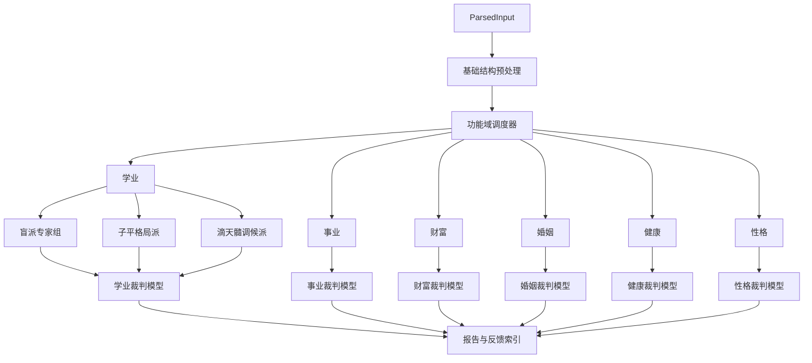

# 多流派并行功能域分析与裁判模型架构方案

> 目标：将当前“D1-D4 串行维度引擎”逐步升级为“盲派、子平格局派、调候派（滴天髓）等多流派分别完整分析同一个学业 / 事业 / 财富 / 婚姻 / 健康 / 性格等功能域，再由裁判模型综合判定、仲裁、输出”的多专家系统架构。

---

## 1. 背景与现状

当前架构在 [`engine/contracts/00-OVERVIEW.md`](../engine/contracts/00-OVERVIEW.md) 中定义为 D1-D4 串行维度引擎：

```text
ParsedInput
  → D1 段派 energy
  → D2 杨派 picture
  → D3 任派 yingqi
  → D4 高派 pangzheng
  → integration
  → report
```

现有主流程的核心特点：

- 段派主责能量、做功、格局底盘。
- 杨派主责画面、婚姻、财富细节、调候。
- 任派主责应期、三层门、事件年份。
- 高派主责神煞、旁证、健康灾厄。
- 下游引擎消费上游结果，例如 D2 消费 D1，D3 消费 D1+D2。
- 最终在 [`engine/application/integration.py`](../engine/application/integration.py) 中合并为最终断语。

这套结构的优点是层次清晰、主责明确；缺点是**不能满足“四派各自完整判断同一功能域，然后投票比较”的产品目标**。

---

## 2. 新目标架构

新架构目标不是取消四派维度能力，而是在其上新增“功能域并行分析层”，并把原四派盲派融合系统整体视为“盲派专家组”。在盲派专家组之外，新增两个必须隔离的专家体系：

- **子平格局派**：以格局、用神、十神、旺衰、清浊、成败救应为主轴。
- **调候派（滴天髓）**：以寒暖燥湿、气候平衡、五行流通、病药关系为主轴。

目标流程：

```text
ParsedInput
  → 基础结构预处理
  → 按功能域循环
      → 学业 domain
          → 盲派专家组学业分析
          → 子平格局派学业分析
          → 调候派学业分析
          → 裁判模型综合判定
      → 事业 domain
          → 盲派专家组事业分析
          → 子平格局派事业分析
          → 调候派事业分析
          → 裁判模型综合判定
      → 财富 domain
      → 婚姻 domain
      → 健康 domain
      → 性格 domain
  → 跨域一致性检查
  → 报告渲染
  → statement_index 反馈追踪
```

建议用 Mermaid 表达为：



---

## 3. 设计原则

1. **多专家均有发言权**
   每个功能域默认尝试收集盲派专家组、子平格局派、调候派（滴天髓）三大专家体系意见；盲派专家组内部再保留段、杨、任、高的内部隔离与融合。

2. **流派隔离是硬约束**
   子平格局派、调候派（滴天髓）、盲派专家组不得共用内部判断中间态、不得直接读取彼此未公开的中间结论、不得在本派分析阶段引用对方结论修正自身结论。跨流派信息只能通过统一输出协议进入裁判模型。

3. **允许弃权，但必须显式记录**
   某派在某域无可用规则、规则未接线、置信度过低时，不应强行输出，应记录为 `abstain`。

4. **统一外部协议，不强制统一内部模型**
   每个流派最终都必须输出同一结构的 `ExpertReading`；但各流派内部可以拥有完全不同的模型、术语、规则树和计算流程。

5. **区分“规则存在”和“规则已接入”**
   理论 YAML 中有断语，不等于功能域分析器已可执行。架构中必须标记规则接入状态。

6. **不是直接投票，而是裁判模型**
   系统不做简单少数服从多数；裁判模型需要结合领域权重、规则置信度、历史命中率、样本数、冲突仲裁规则、少数派强证据，形成多专家裁决。

7. **现有 D1-D4 不能立即删除**
   现有引擎仍是盲派专家组的可复用能力库，第一阶段应作为并行功能域分析层的底层素材。

8. **反馈必须能回写到“专家体系 × 子流派 × 功能域 × 规则”**
   否则无法真正比较不同流派在各功能域的实战准确度，也无法动态调整权重。

---

## 4. 现有能力盘点

依据 [`engine/domain-weights.yaml`](../engine/domain-weights.yaml)、[`engine/arbitration.md`](../engine/arbitration.md)、[`engine/domain/analysis.py`](../engine/domain/analysis.py) 与 theory 规则分布，当前可分为三类。

### 4.1 可直接复用

| 能力 | 当前位置 | 可复用方式 |
|---|---|---|
| 段派能量 / 做功 / 格局 | [`engine/energy/`](../engine/energy/) | 作为段派在格局、事业、财富、婚姻底盘中的分析器素材 |
| 杨派财富 / 官命 / 婚姻 / 调候 | [`engine/picture/`](../engine/picture/) | 作为杨派在财富、事业、婚姻、学业、健康部分域的分析器素材 |
| 任派三层门 / 应期 | [`engine/yingqi/`](../engine/yingqi/) | 作为任派对所有事件型功能域的时间判断器 |
| 高派神煞 / 健康 / 旁证 | [`engine/pangzheng/`](../engine/pangzheng/) | 作为高派在健康、婚姻、财富、事业、学业的功能域判断器素材 |
| 领域权重矩阵 | [`engine/domain-weights.yaml`](../engine/domain-weights.yaml) | 可作为初始投票静态权重 |
| 仲裁规则 | [`engine/arbitration.md`](../engine/arbitration.md) | 可作为冲突投票策略的第一版 |
| 派别立场结构 | [`engine/domain/analysis.py`](../engine/domain/analysis.py) | `Stance` 和 `CrossSchoolConflict` 可扩展为投票结构 |

### 4.2 需要适配

| 功能 | 当前问题 | 适配方向 |
|---|---|---|
| `EnergyFindings` | 当前只代表段派 D1，不是段派在每个功能域的完整意见 | 包装成段派各域 `SchoolDomainReading` |
| `PictureFindings` | 当前是杨派综合画像，不按功能域拆成四派投票输入 | 拆出婚姻、财富、事业、学业、健康等域的可投票结论 |
| `GateResult` | 当前表达任派应期结果，不表达任派对功能域状态的完整立场 | 给每个功能域附加任派时间层意见，必要时为 `abstain` 或 `timing_only` |
| `SupportFindings` | 当前是高派 boost，不是高派完整主判 | 转换为高派功能域意见，区分主判、旁证、反对、弃权 |
| `FinalConclusion` | 当前只保存最终合并结论 | 增加 domain vote 来源，或新增并行分析 schema |
| `statement_index.json` | 已增强 rule_ids/schools，但还不完整表达“派别域内投票” | 增加 domain、school、vote_id、reading_id、stance、verdict_target |

### 4.3 明显缺口

| 缺口 | 说明 |
|---|---|
| 四派 × 功能域分析器接口缺失 | 当前没有统一接口如 `analyze_domain(parsed, domain, school)` |
| 功能域投票模型缺失 | 当前有仲裁文档，但没有可运行的 vote result 领域模型 |
| 规则接线状态缺失 | 不能自动判断某条 theory 规则是否已进入对应功能域分析器 |
| 报告缺少四派并列表达 | 当前报告主要输出整合结论，不展示四派原始立场和投票过程 |
| 反馈无法精确评分到投票层 | 当前可 fanout 到 rule，但还缺 vote/reading 层统计 |

---

## 5. 新领域模型建议

建议新增一个专门的领域模型文件，后续可命名为 `engine/domain/parallel.py`。

核心建模原则：**各流派内部结构可以不同，但外部输出必须一致**。因此不要求子平、滴天髓、盲派内部使用同一套字段；只要求最终适配成统一的专家读数协议。

建议定义：

```python
ExpertSystem = Literal["盲派", "子平", "滴天髓"]
BlindSubSchool = Literal["段", "杨", "任", "高"]
```

### 5.1 DomainAnalysis

表示一个功能域的完整多专家分析结果。

```python
@dataclass
class DomainAnalysis:
    domain: str
    readings: list[ExpertReading]
    adjudication_result: AdjudicationResult
    consensus: DomainConsensus
    conflicts: list[CrossSchoolConflict]
```

### 5.2 ExpertReading

表示某一专家体系对某一功能域的独立判断。它是跨流派唯一允许进入裁判模型的外部协议。

```python
@dataclass
class ExpertReading:
    reading_id: str
    case_id: str
    domain: str
    expert_system: ExpertSystem
    sub_school: Optional[str]
    stance: Literal["support", "oppose", "mixed", "abstain", "timing_only"]
    statement: str
    normalized_claim: str
    confidence: Confidence
    evidence: list[Evidence]
    source_engine: str
    isolation_boundary: str
    limitations: list[str]
```

字段含义：

- `stance`：该派是否支持主结论，是否反对，是否混合，是否弃权。
- `normalized_claim`：投票时使用的标准化命题，例如“婚姻稳定”“婚姻易动”“财运强”“学历高”。
- `source_engine`：来源，如 `energy`、`picture`、`yingqi`、`pangzheng`、`theory_adapter`。
- `limitations`：说明该派意见的限制，例如“仅提供应期，不判断婚姻质量”。

### 5.3 ExpertJudgement

表示裁判模型对某个专家读数的评估结果。注意这不是直接投票，而是裁判模型给出的证据评分。

```python
@dataclass
class ExpertJudgement:
    judgement_id: str
    reading_id: str
    expert_system: ExpertSystem
    sub_school: Optional[str]
    domain: str
    claim: str
    ballot: Literal["yes", "no", "mixed", "abstain"]
    raw_score: float
    prior_domain_weight: float
    confidence_weight: float
    feedback_weight: float
    evidence_quality_weight: float
    conflict_penalty: float
    adjusted_score: float
    rationale: str
```

### 5.4 AdjudicationResult

表示裁判模型对某个功能域命题的裁决结果。

```python
@dataclass
class AdjudicationResult:
    domain: str
    claim: str
    decision: Literal["yes", "no", "mixed", "no_output"]
    winning_experts: list[ExpertSystem]
    dissenting_experts: list[ExpertSystem]
    abstained_experts: list[ExpertSystem]
    support_score: float
    oppose_score: float
    confidence: Confidence
    arbitration_notes: list[str]
    minority_report: list[str]
```

### 5.5 DomainConsensus

表示报告可读的领域最终结论。

```python
@dataclass
class DomainConsensus:
    conclusion_id: str
    domain: str
    headline: str
    final_statement: str
    layer: Literal["多专家共识", "主专家胜出", "强证据少数派胜出", "冲突保留", "独门", "不输出"]
    contributing_experts: list[ExpertSystem]
    dissenting_experts: list[ExpertSystem]
    confidence: Confidence
    evidence: list[Evidence]
    falsifiable: str
```

---

## 6. 新执行流设计

建议新增一个应用层服务，后续可命名为 `engine/application/parallel_domain_runner.py`。

伪流程：

```python
def run_parallel_domain_analysis(parsed: ParsedInput) -> ParallelAnalysisOutput:
    base = build_base_context(parsed)
    domains = select_domains(parsed.questions)

    analyses = []
    for domain in domains:
        readings = []
        for expert in ["盲派", "子平", "滴天髓"]:
            adapter = registry.get(expert, domain)
            reading = adapter.analyze(parsed, base, domain)
            readings.append(reading)

        adjudication = adjudicate(readings, domain)
        consensus = build_consensus(domain, readings, adjudication)
        analyses.append(DomainAnalysis(domain, readings, adjudication, consensus))

    return ParallelAnalysisOutput(
        case_id=parsed.case_id,
        domain_analyses=analyses,
        final_conclusions=[a.consensus for a in analyses if a.consensus.layer != "不输出"],
    )
```

---

## 7. 分析器注册表

建议建立“专家体系 × 功能域”注册表，而不是写大量 if/else。盲派专家组内部再维护“段 / 杨 / 任 / 高”的子注册表，确保外部裁判只接收盲派专家组的聚合 reading，除非报告需要展开盲派内部证据链。

示意：

```python
DOMAIN_ANALYZER_REGISTRY = {
    "学业": {
        "盲派": BlindEducationExpertGroup,
        "子平": ZipingEducationAnalyzer,
        "滴天髓": DitiansuiEducationAnalyzer,
    },
    "事业": {
        "盲派": BlindCareerExpertGroup,
        "子平": ZipingCareerAnalyzer,
        "滴天髓": DitiansuiCareerAnalyzer,
    },
    "财富": {
        "盲派": BlindWealthExpertGroup,
        "子平": ZipingWealthAnalyzer,
        "滴天髓": DitiansuiWealthAnalyzer,
    },
    "婚姻": {
        "盲派": BlindMarriageExpertGroup,
        "子平": ZipingMarriageAnalyzer,
        "滴天髓": DitiansuiMarriageAnalyzer,
    },
    "健康": {
        "盲派": BlindHealthExpertGroup,
        "子平": ZipingHealthAnalyzer,
        "滴天髓": DitiansuiHealthAnalyzer,
    },
    "性格": {
        "盲派": BlindPersonalityExpertGroup,
        "子平": ZipingPersonalityAnalyzer,
        "滴天髓": DitiansuiPersonalityAnalyzer,
    },
}
```

第一阶段不需要一次实现全部分析器，可以用以下策略：

- 已接线能力：输出真实 reading。
- 有 theory 但未接线：输出 `abstain`，说明“理论库存在规则，但当前未接入执行器”。
- 完全缺规则：输出 `abstain`，说明“暂无对应规则”。
- 任派对非应期域：可输出 `timing_only`，表示“仅判断事件发生年份，不判断状态好坏”。

---

## 8. 裁判模型策略

### 8.1 不做直接投票

本系统不应命名为简单 `voting`，而应设计为 `adjudication` 或 `referee`。原因是：

- 流派数量不同于能力大小。
- 不同流派擅长的问题不同。
- 少数派可能持有更强证据。
- 反馈样本积累后，权重必须动态调整。

### 8.2 基础裁判公式

建议：

```text
adjusted_score = raw_score × prior_domain_weight × confidence_weight × feedback_weight × evidence_quality_weight - conflict_penalty
```

其中：

- `raw_score`：该 reading 对 claim 的支持度。
- `prior_domain_weight`：初始领域先验权重。
- `confidence_weight`：来自规则置信度，遵循 [`engine/contracts/06-confidence-model.md`](../engine/contracts/06-confidence-model.md)。
- `feedback_weight`：来自历史反馈，低样本时使用 Beta 后验，不能用裸命中率。
- `evidence_quality_weight`：证据质量权重，例如规则是否可量化、是否命中多个独立证据、是否有应期验证。
- `conflict_penalty`：内部自相矛盾、跨域矛盾、证据薄弱时的惩罚项。

### 8.3 初始领域权重

用户提出的初始权重可以作为三大专家体系的先验权重。建议先以配置文件形式保存，后续可命名为 `engine/expert-weights.yaml`。

| 主题 | 盲派 | 子平 | 滴天髓 |
|---|---:|---:|---:|
| 财运 | 35% | 45% | 20% |
| 事业 | 25% | 55% | 20% |
| 婚姻 | 50% | 30% | 20% |
| 健康 | 30% | 20% | 50% |
| 性格 | 30% | 30% | 40% |

初始权重只代表先验，不代表永久真理。每完成反馈闭环后，应通过 Beta 后验和有效样本数动态调整。

建议动态公式：

```text
feedback_weight = clamp(beta_mean(expert, domain), 0.70, 1.30)
dynamic_domain_weight = normalize(prior_domain_weight × feedback_weight)
```

约束：

- 当 `n_eff < 5` 时，只允许微调。
- 当 `n_eff >= 10` 且 Wilson 下界明显高于其他专家时，允许较大调权。
- 当某专家连续失验达到阈值时，只降该专家在该功能域的权重，不影响其他功能域。
- 动态权重必须可审计，写入权重变更日志。

### 8.4 裁判层级

| 情况 | 输出层级 |
|---|---|
| 三大专家体系同向 | 多专家共识 |
| 两个专家体系同向，一个弃权 | 双专家共识 |
| 两个专家体系同向，一个反对 | 双专家胜出 + 显示少数派意见 |
| 一个专家体系支持，两个反对 | 反对方胜出，除非支持方有强证据且为该域高权重专家 |
| 仅一个专家体系有结论 | 独门，降置信输出 |
| 无专家体系有结论 | 不输出 |
| 盲派内部段杨任高分裂 | 先在盲派专家组内形成盲派 reading，再进入三大专家裁判 |

### 8.5 低样本原则

当某专家体系某域 `n_eff < 5` 时：

- 不允许宣称“该派在该域最准”。
- `feedback_weight` 只可作为弱调整。
- 报告中显示“样本不足，仅作趋势参考”。

---

## 9. 报告结构改造

建议新报告增加“多专家裁判区块”。

示例：

```text
## 婚姻域 · 多专家裁判

### 专家原始判断
- 盲派专家组：婚姻以宫星感应、画面、应期与旁证综合看，早期易动…… ★★★★
- 子平格局派：以配偶星、夫妻宫、格局清浊看，婚姻有成但需看运…… ★★★
- 滴天髓调候派：以寒暖燥湿与五行流通看，情绪与关系温度有波动…… ★★

### 裁判结果
- 主命题：婚姻早期易动，后期趋稳
- 支持：盲派、子平
- 保留：滴天髓
- 胜出：双专家共识
- 置信度：★★★★ 82%

### 少数派意见
- 滴天髓派认为调候失衡主要体现为情绪温度波动，不必直接等同于婚姻破裂。

### 盲派内部展开
- 段派：婚姻底盘不必然破。
- 杨派：婚姻画像显示早期窗口波动。
- 任派：婚恋事件在某大运某流年有触发。
- 高派：神煞旁证显示婚姻易动。
```

报告中必须避免只显示最终结论，而隐藏多专家分歧。否则用户无法判断各专家体系的贡献与反对意见。

---

## 10. 反馈与统计改造

为了真正比较多专家准确度，`statement_index.json` 需要从“最终断语索引”扩展为“断语 + reading + adjudication”索引。

建议字段：

```json
{
  "statement_id": "S-026-abcdef",
  "domain": "婚姻",
  "summary": "婚姻早期易动，后期趋稳",
  "status": "pending",
  "section": "婚姻域多专家裁判",
  "rule_ids": ["M2-Y-038", "GP-MAR-桃花"],
  "expert_systems": ["盲派", "子平", "滴天髓"],
  "blind_sub_schools": ["杨", "高"],
  "reading_ids": ["RD-HY-BLIND-001", "RD-HY-ZIPING-001"],
  "adjudication_id": "ADJ-HY-001",
  "claim": "婚姻早期易动",
  "decision": "yes",
  "supporting_experts": ["盲派", "子平"],
  "dissenting_experts": [],
  "abstained_experts": ["滴天髓"]
}
```

反馈摄入后应能更新：

- 规则级 `hits/misses`。
- 专家体系 × 功能域命中率。
- 盲派内部子流派 × 功能域命中率。
- reading 级命中率。
- adjudication 级裁判正确率。
- 少数派意见是否后来被证实。
- 动态权重调整记录。

---

## 11. 原理教案入口与理论提取流程

为便于后续补充子平格局派、滴天髓调候派原始教案，先预留独立资料入口，并保持与“流派隔离”原则一致：

| 入口 | 用途 | 约束 |
|---|---|---|
| [`sources/ziping/`](../sources/ziping/) | 子平格局派原始教案、讲义、摘录、图片 OCR 文本入口 | 只存原始或准原始资料，不直接写可执行规则 |
| [`sources/tiaohou_ditiansui/`](../sources/tiaohou_ditiansui/) | 滴天髓调候派原始教案、讲义、摘录、图片 OCR 文本入口 | 只存原始或准原始资料，不与子平、盲派资料混放 |
| [`templates/theory-extraction-template.md`](../templates/theory-extraction-template.md) | 从原始教案提取候选断语、适用条件、证伪条件与 YAML 草案 | 提取结果仍需人工审校后才能进入 `theory/` |

推荐资料处理链路：

```text
sources/ziping 或 sources/tiaohou_ditiansui
  → 使用 theory-extraction-template 提取候选命题
  → theory/ziping 或 theory/tiaohou_ditiansui 候选规则
  → 规则审校与生命周期标注
  → engine/ziping 或 engine/tiaohou_ditiansui 可执行分析器
  → ExpertReading
  → 裁判模型
```

关键约束：

1. 原始教案入口只承担“材料接收”和“出处追溯”，不得混入已裁决的规则结论。
2. 理论提取模板输出的是候选规则，不代表已接线、已验证或可用于正式报告。
3. 子平格局派与滴天髓调候派后续即使分析同一功能域，也必须从各自资料入口和各自规则库独立形成判断。
4. 进入裁判模型前，所有提取结果必须适配为统一 `ExpertReading`，但不要求两派内部术语和推理结构一致。

---

## 12. 渐进迁移路线

### 阶段 1：只做架构与 schema 准备

- 新增架构文档。
- 预留子平格局派、滴天髓调候派原始教案入口。
- 提供原始教案到候选规则的理论提取模板。
- 明确新数据模型。
- 明确注册表、投票、报告、反馈改造边界。
- 不改当前生产流程。

### 阶段 2：新增旁路模型与测试

- 新增 `ExpertReading`、`ExpertJudgement`、`AdjudicationResult`、`DomainAnalysis`。
- 新增 `parallel_domain_runner` 骨架。
- 用 mock analyzer 跑通多专家裁判。
- 保持 [`engine/application/pipeline_runner.py`](../engine/application/pipeline_runner.py) 默认行为不变。

### 阶段 3：接入第一个功能域

建议先选“婚姻”或“财富”。

原因：

- 婚姻已有杨派主判、任派应期、高派旁证、段派底盘。
- 财富已有段派层级、杨派财级、高派财运规则、任派财运应期。

输出要求：

- 每个专家体系至少一个 reading 或显式 abstain。
- 产生 adjudication_result。
- 报告显示多专家意见。
- statement_index 可追踪到 reading/adjudication。

### 阶段 4：扩展到五大功能域

按顺序建议：

1. 婚姻
2. 财富
3. 事业
4. 健康
5. 学业

### 阶段 5：反馈闭环升级

- `feedback_ingest` 支持 reading/adjudication fanout。
- `cross_school_scan` 从“规则 topic 聚合”升级为“专家体系 × 功能域 × adjudication/reading 聚合”。
- 统计展示 Beta 后验、Wilson 区间、`n_eff`。

### 阶段 6：报告默认切换

当五大域与性格域均具备多专家并行分析，并且测试通过后，再考虑把默认报告从“D1-D4 串行整合版”切换为“多专家功能域裁判版”。

---

## 13. 风险与控制

| 风险 | 控制 |
|---|---|
| 多专家强行发言导致幻觉 | 允许显式 abstain，不接线不输出 |
| 裁判退化为机械多数决 | 引入领域权重、置信度、反馈权重、证据质量、冲突惩罚与少数派报告 |
| 报告过长 | 每域显示摘要，详细 evidence 放附录或 statement_index |
| 反馈无法归因 | statement_index 必须记录 reading_id、adjudication_id、expert_system、sub_school、domain、rule_ids |
| 旧流程被破坏 | 初期只做旁路，不替换 [`engine/application/pipeline_runner.py`](../engine/application/pipeline_runner.py) 默认流程 |
| 规则库存在但不可执行 | 增加接线状态，区分 theory-only 与 executable |

---

## 14. 推荐第一批落地文件

后续进入代码阶段时，建议第一批新增或修改：

| 文件 | 动作 | 目的 |
|---|---|---|
| `engine/domain/parallel.py` | 新增 | 定义并行功能域分析领域模型 |
| `engine/application/parallel_domain_runner.py` | 新增 | 编排多专家 × 功能域分析 |
| `engine/application/domain_analyzers.py` | 新增 | 分析器协议与注册表 |
| `engine/application/adjudication.py` | 新增 | 裁判模型与多专家综合判定 |
| `engine/expert-weights.yaml` | 新增 | 保存盲派、子平、滴天髓在各功能域的初始权重与动态权重 |
| [`sources/ziping/`](../sources/ziping/) | 已新增 | 子平格局派原始教案入口 |
| [`sources/tiaohou_ditiansui/`](../sources/tiaohou_ditiansui/) | 已新增 | 滴天髓调候派原始教案入口 |
| [`templates/theory-extraction-template.md`](../templates/theory-extraction-template.md) | 已新增 | 原始教案到候选规则的理论提取模板 |
| `engine/ziping/` | 后续新增 | 子平格局派隔离实现目录 |
| `engine/tiaohou_ditiansui/` | 后续新增 | 调候派（滴天髓）隔离实现目录 |
| `tests/test_parallel_domain_models.py` | 新增 | 验证模型序列化与裁判结构 |
| `tests/test_parallel_domain_runner.py` | 新增 | 用 mock analyzer 验证多专家裁判流程 |
| `tools/render_report.py` | 后续修改 | 增加多专家裁判报告区块 |
| `tools/feedback_ingest.py` | 后续修改 | 支持 reading/adjudication 反馈 fanout |

---

## 15. 与当前架构的关系

新架构不是简单回退到旧的“领域权重矩阵”，而是对当前 v1.2-D1-D4 的升级：

```text
旧 v1.0：领域 × 派别权重矩阵，偏静态。
当前 v1.2：四派维度串行引擎，偏结构化。
目标 v1.5：盲派、子平、滴天髓多专家隔离分析，形成并行 reading + adjudication。
```

换言之：

```text
不是废弃 D1-D4。
而是让 D1-D4 从“唯一流水线阶段”变成“盲派专家组的内部能力库”。
```

---

## 16. 建议结论

建议采用**渐进旁路方案**：

1. 保留现有 D1-D4 主流程。
2. 把现有段、杨、任、高整合为盲派专家组，同时保留内部子流派隔离。
3. 新增子平格局派与调候派（滴天髓）两个隔离专家体系。
4. 新增统一外部输出协议 `ExpertReading`，但不强制各流派内部结构一致。
5. 新增裁判模型，而不是简单投票引擎。
6. 使用用户提供的主题权重作为初始先验，并通过反馈闭环动态调控。
7. 先用婚姻或财富跑通多专家 reading + adjudication。
8. 报告中先新增“多专家裁判区块”，不立即替换全文结构。
9. 反馈系统同步支持 reading/adjudication 归因。
10. 等五大域稳定后，再考虑默认切换。

这样既能满足“多流派分别完整分析同一功能域，再由裁判模型综合判定”的目标，又能避免一次性重构破坏当前报告、反馈、测试与归档流程。
