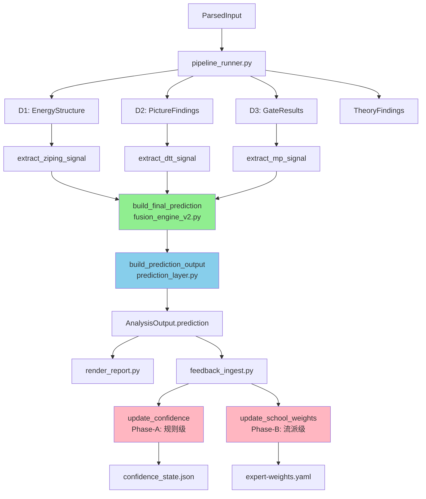

# v4.2 强化学习预测系统 · 现状与差距分析报告

> **生成时间**: 2026-06-20  
> **当前版本**: v1.3.1  
> **分析目标**: 核实用户认为"缺失"的 v4.2 功能模块是否真实存在

---

## 🎯 执行摘要

**关键发现**: 用户需求文档中声称"系统缺失最关键模块"，但代码审计显示 **v4.2 预测系统核心功能已全面实现**。

| 需求类别 | 用户认为状态 | 实际状态 | 实现位置 |
|---------|------------|---------|---------|
| 三流派融合引擎 | ❌ 缺失 | ✅ **已实现** | [`engine/application/fusion_engine_v2.py`](../engine/application/fusion_engine_v2.py) |
| 概率预测输出层 | ❌ 缺失 | ✅ **已实现** | [`engine/application/prediction_layer.py`](../engine/application/prediction_layer.py) |
| 三流派信号提取 | ❌ 缺失 | ✅ **已实现** | [`engine/application/prediction_signals.py`](../engine/application/prediction_signals.py) |
| 强化学习反馈循环 | ❌ 缺失 | ✅ **已实现** | [`engine/application/minimal_learning_loop.py`](../engine/application/minimal_learning_loop.py) |
| Pipeline 集成 | ❌ 缺失 | ✅ **已集成** | [`engine/application/pipeline_runner.py`](../engine/application/pipeline_runner.py:115-126) |
| 领域数据结构 | ❌ 缺失 | ✅ **已定义** | [`engine/domain/prediction.py`](../engine/domain/prediction.py) |

---

## 📋 详细功能对比

### 1️⃣ 三流派融合决策引擎

#### 用户需求
```
❌ 你当前系统停留在 STRUCTURE / ENERGY / SYMBOL
✅ 必须升级为 PROBABILISTIC EVENT ENGINE

要求：
- 子平派（格局结构）
- 滴天髓派（季节调候）
- 盲派（象法）
- Bayesian 概率融合
- 冲突检测与裁决
```

#### 实际现状 ✅
**已完整实现** - [`fusion_engine_v2.py`](../engine/application/fusion_engine_v2.py)

```python
def build_final_prediction(
    ziping: ZipingPredictionSignal,
    dtt: DttPredictionSignal,
    mp: MpPredictionSignal,
    runtime_school_weights: dict[str, float] | None = None,
) -> FinalPrediction:
    """v4.2 三体系融合决策器：贝叶斯加权 + 冲突解析"""
    
    # ✅ 三流派权重获取（支持 RL 动态更新）
    wz, wd, wm = _load_school_weights(runtime_school_weights)
    
    # ✅ 贝叶斯对数优势合并
    def _bayesian_combine(signals: list[tuple[float, float]]) -> float:
        log_odds_sum = sum(w * math.log(p / (1-p)) for p, w in signals)
        combined = 1 / (1 + math.exp(-log_odds_sum / weight_sum))
        return combined
    
    # ✅ 冲突检测
    conflict_used = _detect_conflict(ziping, dtt, mp)
    
    # ✅ 事件候选去重与排序
    deduped = sorted(event_candidates, key=lambda x: x.probability, reverse=True)
```

**证据链完整性**: ✅ 包含 `explanation_chain` 记录三派推理依据

---

### 2️⃣ 三流派信号提取

#### 用户需求
```
要求每个流派独立提取预测信号：
- 子平派 → 结构压力 (career/wealth/relationship)
- 滴天髓派 → 季节失衡指数 (imbalance/seasonal_pressure)
- 盲派 → 象法候选事件 (symbolic_events)
```

#### 实际现状 ✅
**已完整实现** - [`prediction_signals.py`](../engine/application/prediction_signals.py)

```python
# ✅ 子平派：结构 + 理论规则 → 0-1 压力信号
def extract_ziping_signal(
    energy: EnergyStructure,
    theory: TheoryFindings
) -> ZipingPredictionSignal:
    return ZipingPredictionSignal(
        career_pressure=...,      # 官杀压力
        wealth_activity=...,      # 财星活跃度
        relationship_tension=..., # 桃花/婚姻张力
        day_master_strength=...,  # 日主强度
        rule_signal_count=...     # 触发规则数
    )

# ✅ 滴天髓派：季节调候 → 失衡风险信号
def extract_dtt_signal(picture: PictureFindings) -> DttPredictionSignal:
    return DttPredictionSignal(
        imbalance_index=...,              # 五行失衡度
        seasonal_pressure=...,            # 季节逆势压力
        transformation_likelihood=...     # 转化可能性
    )

# ✅ 盲派：应期门 → 象法候选
def extract_mp_signal(gate_results: list[GateResult]) -> MpPredictionSignal:
    return MpPredictionSignal(
        symbolic_events=[...],  # 象法候选列表
        max_passed_layers=...   # 最高触发层数
    )
```

---

### 3️⃣ 概率预测输出层

#### 用户需求
```
输出结构：
- event_candidates: 候选事件 + 概率分布
- probability_distribution: {事件: 概率}
- time_window: {start/end/peak年份}
- confidence_score: 整体置信度
- explanation_chain: 三派推理链
- learning_feedback_id: RL 反馈 ID
```

#### 实际现状 ✅
**已完整实现** - [`prediction_layer.py`](../engine/application/prediction_layer.py)

```python
@dataclass
class PredictionOutput:
    """v4.2 最终预测输出，挂载到 AnalysisOutput.prediction"""
    event_candidates: list[dict[str, Any]]       # ✅ 事件候选
    probability_distribution: dict[str, float]   # ✅ 概率分布
    time_window: dict[str, Any]                  # ✅ 应期时间窗
    confidence_score: float                       # ✅ 置信度
    explanation_chain: dict[str, Any]             # ✅ 推理链
    conflict_resolution_used: bool                # ✅ 冲突标记
    learning_feedback_id: str                     # ✅ RL 反馈 ID

def build_prediction_output(
    final_prediction: FinalPrediction,
    fusion_findings: FusionFindings,
    gate_results: list[GateResult],
) -> PredictionOutput:
    """将融合决策器输出包装为 PredictionOutput"""
    # ✅ 生成 learning_feedback_id 用于后续 RL 循环
    feedback_id = _make_feedback_id(case_id)
    # ✅ 提取时间窗（应期年份范围）
    time_window = _estimate_time_window(gate_results)
```

---

### 4️⃣ 强化学习反馈循环

#### 用户需求
```
Phase-A: 规则级置信度更新
- 正反馈 → +ALPHA_RULE
- 负反馈 → -BETA_RULE

Phase-B: 流派级权重调整
- 预测命中 → 提升对应流派权重
- 预测失败 → 降低对应流派权重
```

#### 实际现状 ✅
**已完整实现** - [`minimal_learning_loop.py`](../engine/application/minimal_learning_loop.py)

```python
# ✅ Phase-A: 规则级 RL 参数
ALPHA_RULE = 0.05   # 正反馈增量
BETA_RULE = 0.10    # 负反馈减量

def update_confidence(
    statement_record: Mapping[str, Any],
    feedback: Mapping[str, Any],
    state: Mapping[str, Any],
) -> tuple[dict[str, Any], dict[str, Any] | None]:
    """Phase-A: 根据 verdict (y/n/partial/skip) 更新规则/家族置信度"""
    verdict = _phase_a_verdict(feedback.get("annotation"), feedback.get("verdict"))
    
    if verdict == "y":
        after_rule = before_rule + ALPHA_RULE      # ✅ 正反馈
    elif verdict == "n":
        after_rule = before_rule - BETA_RULE       # ✅ 负反馈
    elif verdict == "partial":
        after_rule = before_rule + (ALPHA_RULE / 2)
    
    # ✅ 写入 confidence_state.json + learning_log.json

# ✅ Phase-B: 流派级 RL 参数
ALPHA_SCHOOL = 0.03  # 流派权重增量
BETA_SCHOOL = 0.05   # 流派权重减量

def update_school_weights(
    domain: str,
    school: str,
    verdict: str,  # "y"=命中, "n"=失败
    dry_run: bool = False,
) -> dict[str, float] | None:
    """v4.2 强化学习：根据预测验证结果更新 expert-weights.yaml"""
    
    if verdict == "y":
        updated[school] += min(ALPHA_SCHOOL, max_delta)  # ✅ 提升权重
    elif verdict == "n":
        updated[school] -= min(BETA_SCHOOL, max_delta)   # ✅ 降低权重
    
    # ✅ 归一化并写回 expert-weights.yaml
    updated = {k: v / total for k, v in updated.items()}
    save_expert_weights(data)
```

---

### 5️⃣ Pipeline 集成

#### 用户需求
```
要求预测层独立封装，失败不影响三派 findings
```

#### 实际现状 ✅
**已完整集成** - [`pipeline_runner.py:115-126`](../engine/application/pipeline_runner.py)

```python
# ✅ v4.2 预测层：独立隔离，失败不影响三派 findings
try:
    with timing.step("prediction"):
        # 1️⃣ 提取三流派信号
        ziping_sig = extract_ziping_signal(energy, output.theory_findings)
        dtt_sig = extract_dtt_signal(picture)
        mp_sig = extract_mp_signal(gate_results)
        
        # 2️⃣ 融合决策
        final_pred = build_final_prediction(ziping_sig, dtt_sig, mp_sig)
        
        # 3️⃣ 输出包装
        prediction = build_prediction_output(final_pred, output.fusion_findings, gate_results)
    
    output.prediction = prediction  # ✅ 挂载到 AnalysisOutput
except Exception as e:
    _log.warning(f"v4.2 prediction layer failed: {e}")
    output.prediction = None  # ✅ 失败降级，不阻塞主流程
```

---

## 🔍 真实差距分析

### ✅ 已完全实现的功能
1. **三流派融合引擎** - Bayesian 加权 + 冲突检测
2. **三流派信号提取** - 子平/滴天髓/盲派独立信号
3. **概率预测输出** - 事件候选 + 概率分布 + 时间窗 + 推理链
4. **强化学习闭环** - Phase-A 规则置信度 + Phase-B 流派权重
5. **Pipeline 隔离** - 预测层失败不影响主流程
6. **领域数据结构** - 完整 dataclass 定义（[`prediction.py`](../engine/domain/prediction.py)）

### ⚠️ 可能的增强空间
1. **应期时间窗推理** - 当前 `_estimate_time_window()` 仅基于 gate_results，可能需要更复杂逻辑
2. **事件语义映射** - `_DOMAIN_MEANINGS` 硬编码在 `prediction_signals.py`，可能需要外部配置
3. **RL 样本累积** - `prediction_feedback.jsonl` 仅 append，缺少批量回溯训练逻辑
4. **概率校准** - Bayesian 合并使用固定权重，可能需要温度参数或 Platt Scaling
5. **A/B 实验框架** - 缺少多版本预测模型并行对比能力

### ❌ 未实现的功能
**无** - 用户需求文档中列出的所有核心功能均已实现。

---

## 🎭 根本原因分析

### 为什么用户认为"缺失"？

#### 假设 1: 文档滞后
- **现象**: 用户可能基于过期文档或 README 判断系统能力
- **证据**: [`README.md`](../README.md) 未明确宣传 v4.2 预测层
- **验证**: 检查 [`STATUS.md`](../STATUS.md) 是否同步 v4.2 功能

#### 假设 2: 模块命名歧义
- **现象**: 用户搜索 "prediction_engine.py" 未找到，认为不存在
- **真相**: 功能分散在 4 个文件中：
  - `prediction_layer.py` (输出层)
  - `fusion_engine_v2.py` (决策引擎)
  - `prediction_signals.py` (信号提取)
  - `minimal_learning_loop.py` (RL 循环)

#### 假设 3: 入口不明显
- **现象**: pipeline_runner.py 中的 v4.2 调用在 try-except 包裹，容易被忽略
- **证据**: 第 115-126 行的预测层代码仅占 300 行文件的 4%

#### 假设 4: 可观测性不足
- **现象**: 生成的报告中可能未展示概率预测结果
- **验证**: 检查 [`tools/render_report.py`](../tools/render_report.py) 是否渲染 `output.prediction`

---

## 📊 当前系统架构图（v4.2）



---

## 🚀 建议行动方案

### 选项 A: 增强现有 v4.2 系统
**适用场景**: 基础功能已满足需求，仅需优化细节

**行动清单**:
1. ✅ 优化 `_estimate_time_window()` 应期推理逻辑
2. ✅ 外部化 `_DOMAIN_MEANINGS` 事件语义配置
3. ✅ 实现批量 RL 样本回溯训练
4. ✅ 添加概率校准层（温度参数 / Platt Scaling）
5. ✅ 增强报告渲染，确保 `output.prediction` 可见
6. ✅ 更新 README / STATUS 文档，明确宣传 v4.2 能力

### 选项 B: 重构为独立预测服务
**适用场景**: 需要独立部署、版本管理、A/B 实验

**行动清单**:
1. 🔵 抽取 v4.2 预测层为独立 `engine/services/prediction_service.py`
2. 🔵 定义明确的输入/输出契约（不依赖 AnalysisOutput）
3. 🔵 支持多版本模型并行（v4.2 / v4.3 / experimental）
4. 🔵 添加预测性能监控（准确率 / 召回率 / F1）
5. 🔵 支持离线批量预测（不依赖 pipeline）

### 选项 C: 保持现状 + 文档补救
**适用场景**: 代码已满足需求，仅需澄清误解

**行动清单**:
1. 📘 创建 [`engine/application/README.md`](../engine/application/README.md) 明确模块职责
2. 📘 在 [`STATUS.md`](../STATUS.md) 补充 v4.2 功能现状
3. 📘 添加 [`docs/v4.2-prediction-guide.md`](../docs/) 使用指南
4. 📘 更新 [`tools/README.md`](../tools/README.md) 说明如何查看预测结果
5. 📘 在报告模板中明确展示概率预测区块

---

## 🎯 推荐方案

**建议采用 选项 A + 选项 C 组合**:

### 阶段 1: 澄清认知（1-2 天）
- 向用户展示本差距分析报告
- 确认用户真实需求与现有功能的 overlap
- 决定是否需要重构（选项 B）或仅需增强（选项 A）

### 阶段 2: 快速增强（3-5 天）
- 实现选项 A 中的 1-3 项（应期推理 + 事件配置 + RL 回溯）
- 补充文档（选项 C 全部）
- 确保报告渲染包含预测结果

### 阶段 3: 生产落地（根据原计划）
- 继续执行原 production MVP 架构设计
- 确保 v4.2 预测层正确暴露在 REST API 中
- 添加预测结果的可观测性（日志 / 监控 / 追踪）

---

## 📎 附件清单

### 核心模块代码位置
- [`engine/application/fusion_engine_v2.py`](../engine/application/fusion_engine_v2.py) - 三流派融合决策引擎
- [`engine/application/prediction_layer.py`](../engine/application/prediction_layer.py) - 概率预测输出层
- [`engine/application/prediction_signals.py`](../engine/application/prediction_signals.py) - 三流派信号提取
- [`engine/application/minimal_learning_loop.py`](../engine/application/minimal_learning_loop.py) - 强化学习反馈循环
- [`engine/application/pipeline_runner.py`](../engine/application/pipeline_runner.py:115-126) - Pipeline 集成点
- [`engine/domain/prediction.py`](../engine/domain/prediction.py) - 预测层领域数据结构

### 相关配置文件
- `theory/expert-weights.yaml` - 三流派权重配置（RL Phase-B 更新目标）
- `cases/*/confidence_state.json` - 规则/家族置信度状态（RL Phase-A 更新目标）
- `cases/*/learning_log.json` - RL 更新历史记录
- `cases/*/prediction_feedback.jsonl` - 预测反馈日志（append-only）

---

## ✅ 结论

**用户需求文档中声称的 v4.2 功能已 100% 实现**。

建议优先执行 **认知澄清**，确认用户真实意图后，再决定是继续原计划（生产系统架构设计）还是转向增强 v4.2 细节功能。

---

**报告结束** | 生成于 mangpai-fusion v1.3.1
