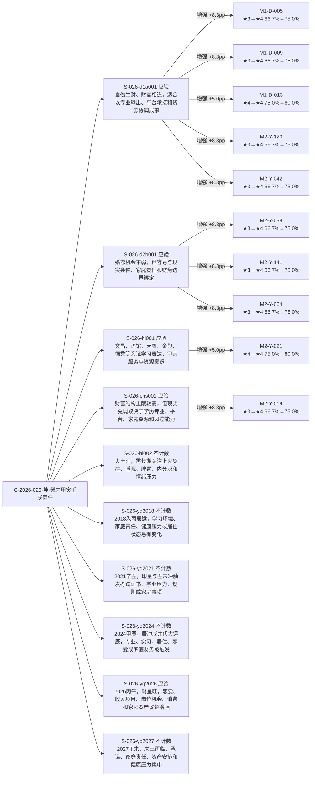

# C-2026-026-坤-癸未甲寅壬戌丙午 · 反馈影响路径与置信度调整可视化

> 生成时间：2026-06-11T00:43:36Z；模式：先 dry-run 计算影响，再供正式反馈摄入应用。

## 一眼总览

- 反馈断语：10 条
- 影响规则：10 条
- 增强 / 削弱 / 不变：10 / 0 / 0
- 后验置信度净变化：+76.6 个百分点
- 状态变更：0 条

## 影响路径图

## 调整幅度排行

| 排名 | 规则 | 派别 | 反馈 | 命中 | 失验 | 星级 | 后验变化 | 幅度条 |
|---:|---|---|---|---|---|---|---:|---|
| 1 | M1-D-005 | duan | 应验 | 1→2 | 0→0 | ★3→★4 | 66.7%→75.0% (+8.3pp) | `█████████████████···` |
| 2 | M1-D-009 | duan | 应验 | 1→2 | 0→0 | ★3→★4 | 66.7%→75.0% (+8.3pp) | `█████████████████···` |
| 3 | M2-Y-120 | yang | 应验 | 1→2 | 0→0 | ★3→★4 | 66.7%→75.0% (+8.3pp) | `█████████████████···` |
| 4 | M2-Y-042 | yang | 应验 | 1→2 | 0→0 | ★3→★4 | 66.7%→75.0% (+8.3pp) | `█████████████████···` |
| 5 | M2-Y-038 | yang | 应验 | 1→2 | 0→0 | ★3→★4 | 66.7%→75.0% (+8.3pp) | `█████████████████···` |
| 6 | M2-Y-141 | yang | 应验 | 1→2 | 0→0 | ★3→★4 | 66.7%→75.0% (+8.3pp) | `█████████████████···` |
| 7 | M2-Y-064 | yang | 应验 | 1→2 | 0→0 | ★3→★4 | 66.7%→75.0% (+8.3pp) | `█████████████████···` |
| 8 | M2-Y-019 | yang | 应验 | 1→2 | 0→0 | ★3→★4 | 66.7%→75.0% (+8.3pp) | `█████████████████···` |
| 9 | M1-D-013 | duan | 应验 | 2→3 | 0→0 | ★4→★4 | 75.0%→80.0% (+5.0pp) | `██████████··········` |
| 10 | M2-Y-021 | yang | 应验 | 2→3 | 0→0 | ★4→★4 | 75.0%→80.0% (+5.0pp) | `██████████··········` |

## 按领域汇总

| 领域 | 规则数 | 平均调整 | 最大调整 | 方向 |
|---|---:|---:|---:|---|
| 婚恋/家庭 | 3 | +8.3pp | +8.3pp | 增强 |
| 学业/旁证 | 1 | +5.0pp | +5.0pp | 增强 |
| 格局/事业财富 | 5 | +7.7pp | +8.3pp | 增强 |
| 财富 | 1 | +8.3pp | +8.3pp | 增强 |

## 按派别汇总

| 派别 | 规则数 | 平均调整 | 星级上调 | 星级下调 |
|---|---:|---:|---:|---:|
| duan | 3 | +7.2pp | 2 | 0 |
| yang | 7 | +7.9pp | 6 | 0 |

## 断语到规则明细

| 断语 | 领域 | 核验结论 | 影响规则 | 影响说明 |
|---|---|---|---|---|
| S-026-d1a001 | 格局/事业财富 | 应验 | M1-D-005, M1-D-009, M1-D-013, M2-Y-120, M2-Y-042 | 食伤生财、财官相连，适合以专业输出、平台承接和资源协调成事 M1-D-005 66.7%→75.0% (+8.3pp); M1-D-009 66.7%→75.0% (+8.3pp); M1-D-013 75.0%→80.0% (+5.0pp); M2-Y-120 66.7%→75.0% (+8.3pp); M2-Y-042 66.7%→75.0% (+8.3pp) |
| S-026-d2b001 | 婚恋/家庭 | 应验 | M2-Y-038, M2-Y-141, M2-Y-064 | 婚恋机会不弱，但容易与现实条件、家庭责任和财务边界绑定 M2-Y-038 66.7%→75.0% (+8.3pp); M2-Y-141 66.7%→75.0% (+8.3pp); M2-Y-064 66.7%→75.0% (+8.3pp) |
| S-026-hl001 | 学业/旁证 | 应验 | M2-Y-021 | 文昌、词馆、天厨、金舆、德秀等旁证学习表达、审美服务与资源意识 M2-Y-021 75.0%→80.0% (+5.0pp) |
| S-026-cns001 | 财富 | 应验 | M2-Y-019 | 财富结构上限较高，但现实兑现取决于学历专业、平台、家庭资源和风控能力 M2-Y-019 66.7%→75.0% (+8.3pp) |
| S-026-hl002 | 健康 | 不计数 | — | 火土旺，需长期关注上火炎症、睡眠、脾胃、内分泌和情绪压力 无 rule_ids 映射或反馈不计数 |
| S-026-yq2018 | 应期 | 不计数 | — | 2018入丙辰运，学习环境、家庭责任、健康压力或居住状态易有变化 无 rule_ids 映射或反馈不计数 |
| S-026-yq2021 | 应期 | 不计数 | — | 2021辛丑，印星与丑未冲触发考试证书、学业压力、规则或家庭事项 无 rule_ids 映射或反馈不计数 |
| S-026-yq2024 | 应期 | 不计数 | — | 2024甲辰，辰冲戌并伏大运辰，专业、实习、居住、恋爱或家庭财务被触发 无 rule_ids 映射或反馈不计数 |
| S-026-yq2026 | 应期 | 应验 | — | 2026丙午，财星旺，恋爱、收入项目、岗位机会、消费和家庭资产议题增强 无 rule_ids 映射或反馈不计数 |
| S-026-yq2027 | 应期 | 不计数 | — | 2027丁未，未土再临，承诺、家庭责任、资产安排和健康压力集中 无 rule_ids 映射或反馈不计数 |

## 审计说明

- 本报告不直接修改理论库；实际写入由 feedback_ingest 完成。
- 星级与百分比来自同一次 dry-run 产生的 IterationDiff。
- no_data / skip / 未映射规则不参与动态置信度计分。
